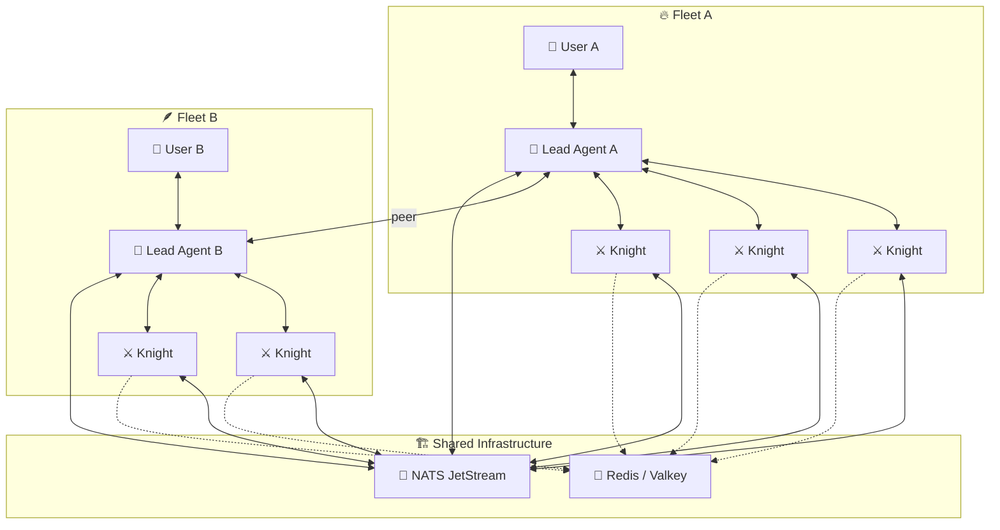

# Knights of the Round Table 🏰⚔️

> *A replicable multi-agent AI platform for Kubernetes*

## The Vision

A **framework for deploying agent fleets.** Each lead agent (user-facing) gets its own "Round Table" — a set of specialized knights that work invisibly behind the scenes. The platform is designed to be instantiated multiple times: one fleet per lead agent, sharing infrastructure but isolated in scope.

**You talk to your agent. Your agent commands its knights. The knights do the work.**

```
User A → Lead Agent A → Agent A's Round Table (Knight 1, Knight 2, Knight 3...)
User B → Lead Agent B → Agent B's Round Table (Knight 4, Knight 5, Knight 6...)
                              ↕ shared NATS + Redis infrastructure
```

## Architecture



### Orchestration

The Round Table uses **thin custom orchestration built directly on NATS JetStream** — no external orchestration framework. We borrow proven design patterns from the orchestration ecosystem:

- **Policy-before-dispatch** — Tasks are validated against policies before reaching knights
- **Payload pointers** — Large payloads stored in object store; messages carry references
- **Capability routing** — Knights declare capabilities; tasks route to matching knights
- **Audit trail** — Every task lifecycle event persisted in durable NATS streams

This gives us full control over the orchestration layer with zero external dependencies beyond NATS itself.

## Core Concepts

| Concept | Description |
|---------|-------------|
| **Lead Agent** | A user-facing OpenClaw gateway. Has personality, memory, channels. Orchestrates its fleet. |
| **Knight** | A specialized OpenClaw gateway. Has personality, memory, skills, sub-agent capability. Invisible to users. Reports to its lead agent via NATS. |
| **Fleet** | A lead agent + its knights. Scoped by NATS topic prefix. |
| **Peer Link** | Lead agents can communicate directly for coordination and delegation. |
| **nats-bridge** | Sidecar that translates NATS messages ↔ OpenClaw webhook calls. Universal adapter. |

## Pod Architecture

Every knight runs as a three-container pod:

| Container | Role |
|-----------|------|
| **OpenClaw Gateway** | Agent runtime — personality, memory, skills, webhook |
| **nats-bridge** | NATS ↔ webhook sidecar |
| **git-sync** | Pulls skills from the arsenal repository |

Skills are delivered via [roundtable-arsenal](https://github.com/dapperdivers/roundtable-arsenal) — a separate repo synced into each knight by git-sync. Push a skill → knights pick it up automatically.

## Installation

### Helm Chart (Recommended)

```bash
# Add dependencies
helm dependency update charts/roundtable/

# Install
helm install roundtable charts/roundtable/ \
  -n roundtable --create-namespace

# Customize — add knights, change models, etc.
helm install roundtable charts/roundtable/ \
  -f my-values.yaml \
  -n roundtable --create-namespace
```

Knights are defined declaratively in `values.yaml`. Add a knight, `helm upgrade`, done.

See [`charts/roundtable/`](charts/roundtable/) for the full chart and value schema.

## Components

| Component | Description | Location |
|-----------|-------------|----------|
| **Helm Chart** | Full stack deployment — knights, NATS, Redis | [`charts/roundtable/`](charts/roundtable/) |
| **nats-bridge** | Go sidecar — NATS ↔ OpenClaw webhook | [`nats-bridge/`](nats-bridge/) |
| **Knight Template** | Legacy Kustomize base (see Helm chart) | [`knights/template/`](knights/template/) |
| **Galahad** | 🛡️ Example knight — Security & threat intelligence | [`knights/galahad/`](knights/galahad/) |
| **NATS Skill** | OpenClaw skill for direct NATS pub/sub | [`skills/nats-agent-bus/`](skills/nats-agent-bus/) |
| **Arsenal** | Skills, protocols, templates — git-synced | [roundtable-arsenal](https://github.com/dapperdivers/roundtable-arsenal) |

## Example Knight Roster

| Knight | Domain | Responsibilities |
|--------|--------|-----------------|
| 🛡️ **Galahad** | Security | Threat intel, CVE analysis, security briefings |
| 📧 **Percival** | Communications | Email triage, notification routing |
| 🌤️ **Gawain** | Intelligence | Weather, news, OSINT gathering |
| 📊 **Tristan** | Observability | Cluster health, alerting |
| 🏠 **Lancelot** | Home Automation | Smart home orchestration |
| *Custom* | *Any domain* | *Define in values.yaml, deploy with Helm* |

## Tech Stack

- **Kubernetes** — Runtime platform
- **OpenClaw** — Agent runtime (personality, memory, skills, channels)
- **NATS JetStream** — Message bus with durable streams + custom orchestration
- **Redis / Valkey** — Shared state store
- **Go** — nats-bridge sidecar
- **Helm** — Deployment and configuration
- **Anthropic Claude** — LLM backbone (configurable per agent)

## Roadmap

### Phase 1: Foundation 🏗️
- [x] Project scaffold and repo
- [x] Architecture documentation
- [x] Helm chart for full stack deployment
- [ ] nats-bridge sidecar built and tested
- [ ] Message contract finalized
- [ ] Custom orchestration layer on NATS JetStream

### Phase 2: First Fleet ⚔️
- [ ] First knight (Galahad/Security) operational
- [ ] Lead agent ↔ knight communication verified
- [ ] End-to-end task workflow proven

### Phase 3: Multi-Fleet 🌍
- [ ] Second fleet operational
- [ ] Peer communication between lead agents
- [ ] Cross-knight collaboration within a fleet

### Phase 4: Intelligence 🧠
- [ ] Proactive knight behaviors
- [ ] Knight self-improvement
- [ ] Fleet health monitoring and auto-recovery

## Design Principles

1. **Replicable** — The platform deploys N fleets, not just one
2. **Knights are specialized, not dumb** — Each has personality, judgment, memory
3. **NATS is the contract** — Anything that speaks the message format can be a knight
4. **Declarative** — Define knights in values.yaml, deploy with Helm
5. **Users never see knights** — The lead agent synthesizes all output
6. **Fleet isolation** — Topic prefixes keep agent groups separate
7. **Right model for the job** — Lighter models for simpler knights
8. **No external orchestration** — Thin custom layer on NATS JetStream

## License

MIT — see [LICENSE](LICENSE)

---

*"There are some who call me... Tim." 🔥*
