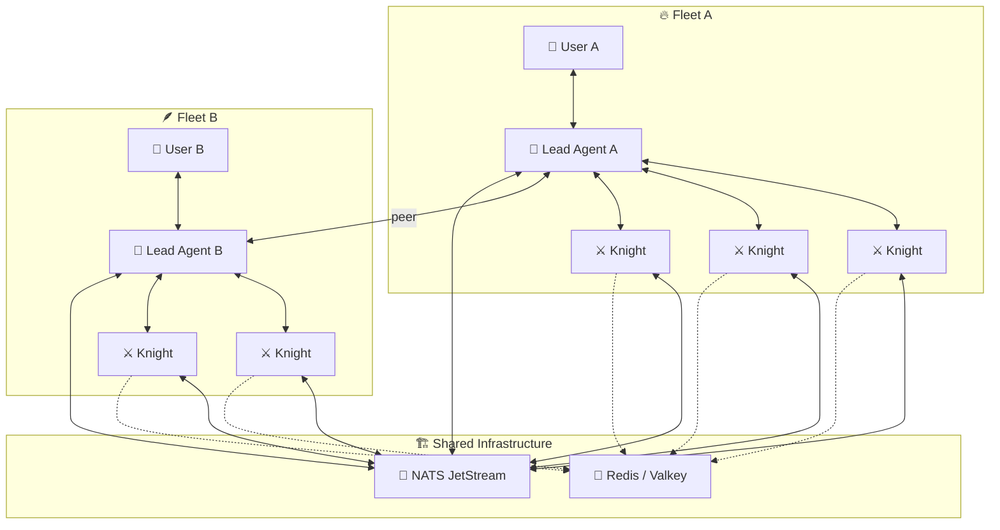
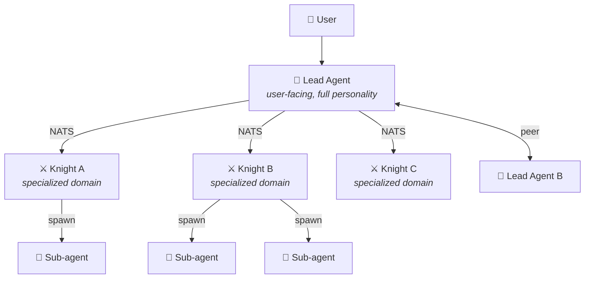
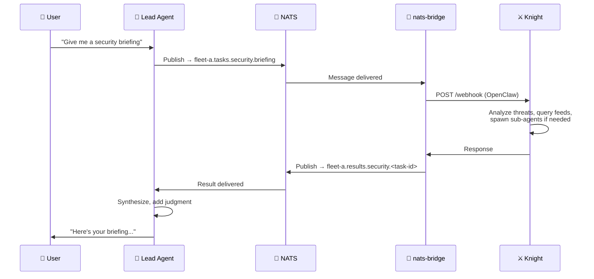
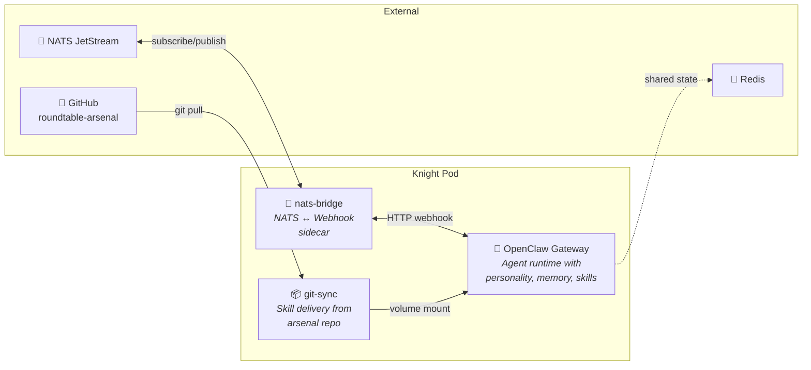

# Knights of the Round Table 🏰⚔️

> *A replicable multi-agent AI platform for Kubernetes*

## The Vision

A **framework for deploying agent fleets.** Each lead agent (user-facing) gets its own "Round Table" — a set of specialized knights that work invisibly behind the scenes. The platform is designed to be instantiated multiple times: one fleet per lead agent, sharing infrastructure but isolated in scope.

**You talk to your agent. Your agent commands its knights. The knights do the work.**

```
User A → Lead Agent A → Agent A's Round Table (Knight 1, Knight 2, Knight 3...)
User B → Lead Agent B → Agent B's Round Table (Knight 4, Knight 5, Knight 6...)
                              ↕ shared NATS + Redis infrastructure
```

## Architecture



## Core Concepts

| Concept | Description |
|---------|-------------|
| **Lead Agent** | A user-facing OpenClaw gateway. Has personality, memory, channels. Orchestrates its fleet. |
| **Knight** | A specialized OpenClaw gateway. Has personality, memory, skills, sub-agent capability. Invisible to users. Reports to its lead agent via NATS. |
| **Fleet** | A lead agent + its knights. Scoped by NATS topic prefix. |
| **Peer Link** | Lead agents can communicate directly for coordination and delegation. |
| **nats-bridge** | Sidecar that translates NATS messages ↔ OpenClaw webhook calls. Universal adapter. |

### The Hierarchy



- **Users** only talk to their lead agent
- **Lead agents** orchestrate knights and can peer with other lead agents
- **Knights** are autonomous within their domain, can spawn sub-agents
- **Sub-agents** are ephemeral workers within a knight's session

## How It Works



## Fleet Isolation via NATS Topics

Each fleet gets its own topic prefix, keeping agent groups isolated:

```
fleet-a.tasks.security.briefing      → Fleet A's security knight
fleet-a.results.security.<id>        → Back to Fleet A's lead agent
fleet-a.heartbeat.galahad            → Fleet A's knight health

fleet-b.tasks.security.briefing      → Fleet B's security knight (different instance)
fleet-b.results.security.<id>        → Back to Fleet B's lead agent

roundtable.broadcast.*               → Cross-fleet announcements (shared)
roundtable.peer.*                    → Lead agent peer communication
```

## Pod Architecture

Every knight runs as a three-container pod:



Skills are delivered via [roundtable-arsenal](https://github.com/dapperdivers/roundtable-arsenal) — a separate repo synced into each knight by a `git-sync` sidecar. Push a skill to the arsenal repo → knights pick it up automatically. Each knight only loads skills for its domain via `extraDirs` config.

## Components

| Component | Description | Location |
|-----------|-------------|----------|
| **nats-bridge** | Go sidecar — translates NATS messages ↔ OpenClaw webhook calls | [`nats-bridge/`](nats-bridge/) |
| **Knight Template** | Kustomize base for deploying any knight in any fleet | [`knights/template/`](knights/template/) |
| **Galahad** | 🛡️ Example knight — Security & threat intelligence | [`knights/galahad/`](knights/galahad/) |
| **NATS Skill** | OpenClaw skill for direct NATS pub/sub from lead agents | [`skills/nats-agent-bus/`](skills/nats-agent-bus/) |
| **Arsenal** | Skills, protocols, and templates — git-synced into knights | [roundtable-arsenal](https://github.com/dapperdivers/roundtable-arsenal) |
| **Infrastructure** | Flux HelmReleases for NATS, Redis, namespace | [`infrastructure/`](infrastructure/) |

## Example Knight Roster

These are example specializations. Each fleet chooses which knights to deploy.

| Knight | Domain | Responsibilities |
|--------|--------|-----------------|
| 🛡️ **Galahad** | Security | Threat intel, CVE analysis, security briefings, RSS monitoring |
| 📧 **Percival** | Communications | Email triage, notification routing, contact management |
| 🌤️ **Gawain** | Intelligence | Weather, news, market data, OSINT gathering |
| 📊 **Tristan** | Observability | Cluster health, alerting, capacity planning |
| 🏠 **Lancelot** | Home Automation | Smart home orchestration, routines, energy management |
| *Custom* | *Any domain* | *Deploy a pod, subscribe to NATS, join the table* |

## Deploying a Fleet

```bash
# 1. Deploy shared infrastructure (once)
kubectl apply -f infrastructure/

# 2. Deploy a knight for your fleet
cd knights/galahad
FLEET_ID=fleet-a kustomize build . | kubectl apply -f -

# 3. Install NATS skill on your lead agent
cp -r skills/nats-agent-bus /path/to/agent/skills/

# 4. Your lead agent can now dispatch tasks via NATS
```

## Roadmap

### Phase 1: Foundation 🏗️
- [x] Project scaffold and repo
- [x] Architecture documentation
- [ ] NATS JetStream deployed to `roundtable` namespace
- [ ] nats-bridge sidecar built and tested
- [ ] Message contract finalized
- [ ] Fleet-scoped topic conventions validated
- [ ] Knight Kustomize template with fleet parameterization

### Phase 2: First Fleet ⚔️
- [ ] First knight (Galahad/Security) operational
- [ ] Lead agent ↔ knight communication via NATS verified
- [ ] End-to-end task workflow proven
- [ ] NATS skill installed on lead agent

### Phase 3: Multi-Fleet 🌍
- [ ] Second fleet operational (proving replicability)
- [ ] Peer communication between lead agents via NATS
- [ ] Redis shared state integration
- [ ] Cross-knight collaboration within a fleet
- [ ] Composite briefing from multiple knights

### Phase 4: Intelligence 🧠
- [ ] Proactive knight behaviors (event-driven triggers)
- [ ] Knight self-improvement (memory, learning from past tasks)
- [ ] Fleet health monitoring and auto-recovery
- [ ] Performance tuning (model selection per knight)

## Design Principles

1. **Replicable** — The platform deploys N fleets, not just one
2. **Knights are specialized, not dumb** — Each has personality, judgment, memory, and can spawn sub-agents
3. **NATS is the contract** — Anything that speaks the message format can be a knight
4. **GitOps everything** — Deploy/remove knights and fleets with `kubectl apply/delete`
5. **Users never see knights** — The lead agent is the interface; it synthesizes all output
6. **Fleet isolation** — Topic prefixes keep agent groups separate
7. **Right model for the job** — Lighter models for knights that don't need heavy reasoning
8. **Fail gracefully** — A dead knight doesn't crash the fleet; the lead agent adapts

## Tech Stack

- **Kubernetes** — Runtime platform
- **OpenClaw** — Agent runtime (personality, memory, skills, channels)
- **NATS JetStream** — Message bus with durable streams
- **Redis / Valkey** — Shared state store
- **Go** — nats-bridge sidecar
- **Flux** — GitOps deployment
- **Anthropic Claude** — LLM backbone (configurable per agent)

## License

MIT — see [LICENSE](LICENSE)

---

*"There are some who call me... Tim." 🔥*
