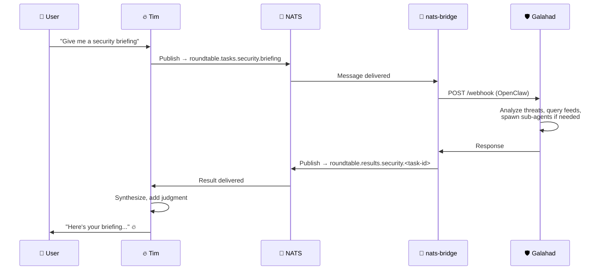
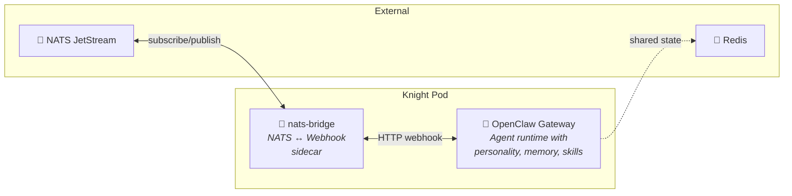

# Knights of the Round Table 🏰⚔️

> *A multi-agent AI platform for Kubernetes homelabs*

## The Vision

Deploy specialized AI agents as independent Kubernetes pods, connected by a NATS JetStream message bus, orchestrated by a lead agent. Each "Knight" has its own personality, memory, skills, and judgment — but serves the realm invisibly.

**You talk to the wizard. The wizard commands the knights. The knights do the work.**

## Architecture

```mermaid
graph TB
    subgraph Users["👥 User Layer"]
        User["🧑 User"]
        User B["🧑 User B"]
    end

    subgraph Core["🔥 Core Agents"]
        Tim["🔥 Tim the Enchanter<br/><i>Lead Agent · JARVIS</i>"]
        Munin["🪶 Munin<br/><i>Apprentice Raven</i>"]
    end

    subgraph Bus["📡 Message Bus"]
        NATS["NATS JetStream"]
    end

    subgraph Knights["⚔️ Knights of the Round Table"]
        Galahad["🛡️ Galahad<br/><i>Security</i>"]
        Percival["📧 Percival<br/><i>Communications</i>"]
        Gawain["🌤️ Gawain<br/><i>Intelligence</i>"]
        More["➕ ...extensible"]
    end

    subgraph State["💾 Shared State"]
        Redis["Redis / Valkey"]
    end

    User <--> Tim
    User B <--> Munin
    Tim <-->|"peer"| Munin
    Tim <--> NATS
    Munin <--> NATS
    NATS <--> Galahad
    NATS <--> Percival
    NATS <--> Gawain
    NATS <--> More
    Galahad -.-> Redis
    Percival -.-> Redis
    Gawain -.-> Redis
```

## The Hierarchy

| Role | Agent | Interface | Purpose |
|------|-------|-----------|---------|
| 🧑 **User** | 🔥 Tim the Enchanter | Direct chat | Primary user. Tim is their JARVIS. |
| 🧑 **User B** | 🪶 Munin | Direct chat | Secondary user's agent. Also Tim's apprentice. |
| 🔥 **Tim** | 🪶 **Munin** | Peer (HTTP/NATS) | Lead agents communicate directly for coordination. |
| 🤖 **Tim** | ⚔️ All Knights | NATS bus | Tim orchestrates. Knights never talk to users. |
| ⚔️ **Knights** | 🔧 Sub-agents | Internal | Knights can spawn their own workers. |

> **Key principle:** User and User B never interact with knights directly. Tim synthesizes all knight outputs and presents them in his own voice.

## How It Works



## Pod Architecture

Every knight runs as a two-container pod:



## Components

| Component | Description | Location |
|-----------|-------------|----------|
| **nats-bridge** | Go sidecar — translates NATS messages ↔ OpenClaw webhook calls | [`nats-bridge/`](nats-bridge/) |
| **Knight Template** | Kustomize base for deploying any knight | [`knights/template/`](knights/template/) |
| **Galahad** | 🛡️ First knight — Security & threat intelligence | [`knights/galahad/`](knights/galahad/) |
| **NATS Skill** | OpenClaw skill for direct NATS pub/sub from Tim/Munin | [`skills/nats-agent-bus/`](skills/nats-agent-bus/) |
| **Infrastructure** | Flux HelmReleases for NATS, Redis, namespace | [`infrastructure/`](infrastructure/) |

## Planned Knights

| Knight | Domain | Responsibilities |
|--------|--------|-----------------|
| 🛡️ **Galahad** | Security | Threat intel, CVE analysis, security briefings, RSS monitoring |
| 📧 **Percival** | Communications | Email triage, notification routing, contact management |
| 🌤️ **Gawain** | Intelligence | Weather, news, market data, OSINT gathering |
| 📊 **Tristan** | Observability | Cluster health, alerting, capacity planning |
| 🏠 **Lancelot** | Home Automation | Smart home orchestration, routines, energy management |
| *More...* | *Extensible* | *Deploy a pod, subscribe to NATS, join the table* |

## Roadmap

### Phase 1: Foundation 🏗️
- [x] Project scaffold and repo
- [x] Architecture documentation
- [ ] NATS JetStream deployed to `roundtable` namespace
- [ ] nats-bridge sidecar built and tested
- [ ] Message contract finalized
- [ ] Knight Kustomize template validated

### Phase 2: First Knight ⚔️
- [ ] Galahad (Security) fully operational
- [ ] Tim ↔ Galahad communication via NATS verified
- [ ] Security briefing workflow end-to-end
- [ ] NATS skill installed on Tim's gateway

### Phase 3: Expansion 🌍
- [ ] Percival (Communications) deployed
- [ ] Gawain (Intelligence) deployed
- [ ] Redis shared state integration
- [ ] Cross-knight collaboration patterns
- [ ] Daily briefing composed from multiple knights

### Phase 4: Intelligence 🧠
- [ ] Proactive knight behaviors (event-driven triggers)
- [ ] Knight self-improvement (memory, learning from past tasks)
- [ ] Knight health monitoring and auto-recovery
- [ ] Munin ↔ Knight communication
- [ ] Performance tuning (model selection per knight)

## Design Principles

1. **Knights are specialized, not dumb** — Each has personality, judgment, memory, and can spawn sub-agents
2. **NATS is the contract** — Anything that speaks the message format can be a knight
3. **GitOps everything** — Deploy/remove knights with `kubectl apply/delete`
4. **Users never see knights** — Tim is the interface; he synthesizes all output
5. **Right model for the job** — Lighter models for knights that don't need heavy reasoning
6. **Fail gracefully** — A dead knight doesn't crash the system; Tim adapts

## Tech Stack

- **Kubernetes** (Talos on Proxmox) — Runtime platform
- **OpenClaw** — Agent runtime (personality, memory, skills, channels)
- **NATS JetStream** — Message bus with durable streams
- **Redis / Valkey** — Shared state store
- **Go** — nats-bridge sidecar
- **Flux** — GitOps deployment
- **Claude** (Anthropic) — LLM backbone

## Quick Start

> 🚧 Coming in Phase 2 — once the infrastructure is deployed and Galahad is operational.

## License

MIT — see [LICENSE](LICENSE)

---

*"There are some who call me... Tim." 🔥*
