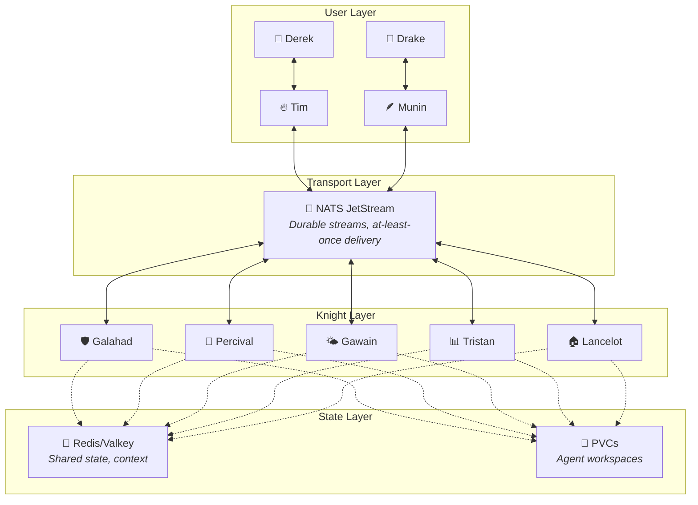
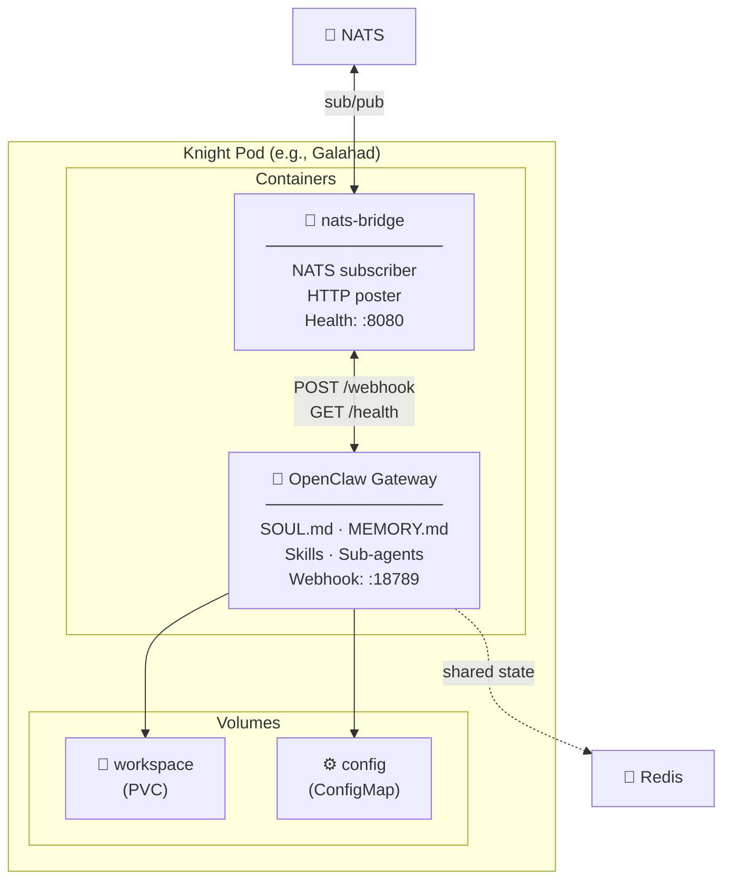
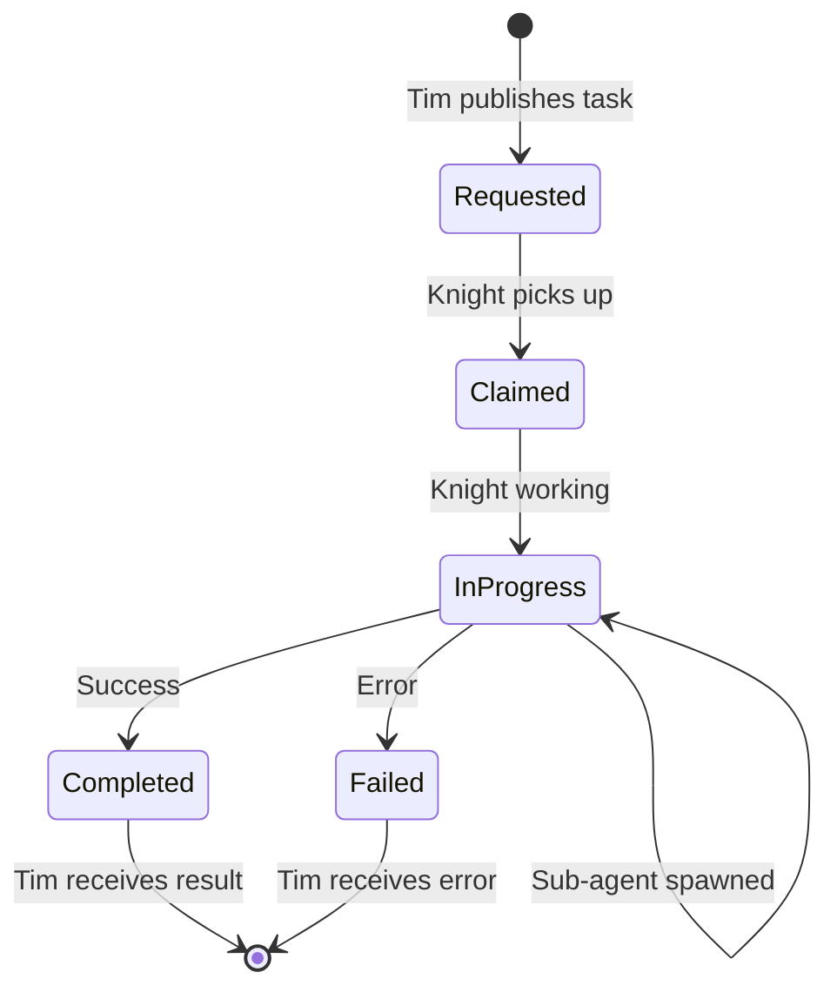
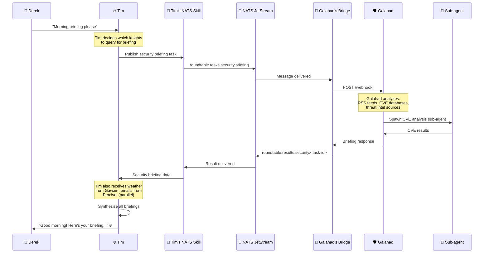
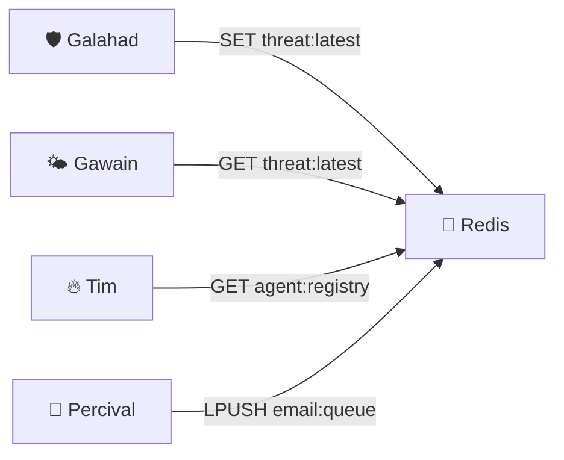
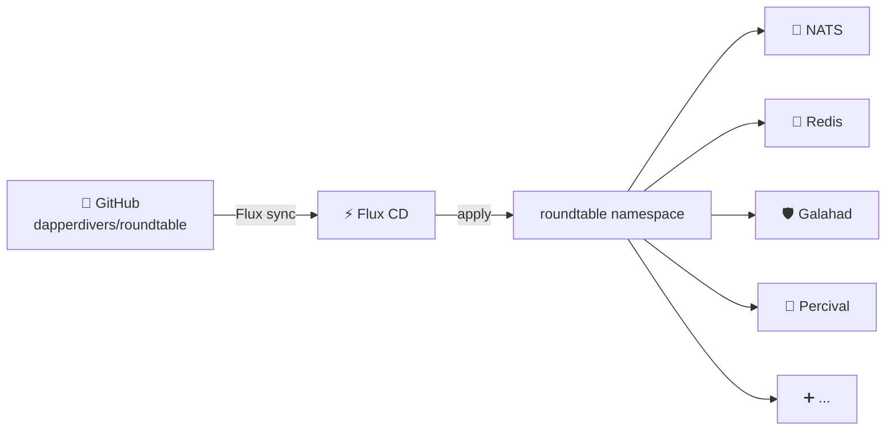

# Architecture Deep Dive

## System Overview

The Round Table is a multi-agent AI platform built on three layers: **User-Facing Agents**, a **Message Bus**, and **Specialist Knights**. All deployed on Kubernetes via GitOps.

## Agent Types

### Core Agents (User-Facing)

These are full OpenClaw gateways with rich personalities, multi-channel support, and human interaction capabilities.

| Agent | Model | Channels | Role |
|-------|-------|----------|------|
| 🔥 Tim | Claude Opus | Discord, Signal, etc. | Derek's primary agent. Orchestrates knights. |
| 🪶 Munin | Configurable | Discord | Drake's agent. Tim's apprentice. |

### Knights (Specialist Agents)

Full OpenClaw gateways with personality and memory, but **no human-facing channels**. They communicate exclusively via NATS.

Each knight has:
- **SOUL.md** — Personality, domain expertise, behavioral guidelines
- **MEMORY.md** — Accumulated domain knowledge
- **Skills** — Domain-specific tools and scripts
- **Sub-agent capability** — Can spawn workers for complex tasks
- **Model config** — Right-sized model for the domain (not everything needs Opus)

## Pod Architecture

### Container: OpenClaw Gateway

The agent brain. Runs the OpenClaw runtime with:
- Agent personality and memory (workspace mounted from PVC)
- Skills for domain-specific tooling
- Webhook endpoint at `:18789` for receiving tasks from the sidecar
- Sub-agent spawning for parallel work within the knight's domain
- Model configuration (can use lighter models like Sonnet/Haiku for cost efficiency)

### Container: nats-bridge Sidecar

The universal adapter. A small Go binary (~200 lines) that:
1. Connects to NATS JetStream
2. Subscribes to the knight's task topics
3. Translates NATS messages → HTTP POST to OpenClaw webhook
4. Captures OpenClaw responses → publishes to NATS result topics
5. Exposes `/healthz` for K8s liveness probes
6. Publishes periodic heartbeats to `roundtable.heartbeat.<agent-id>`

## Communication Flow

### Task Lifecycle

### End-to-End Flow: Security Briefing

## NATS JetStream Configuration

### Streams

| Stream | Subjects | Retention | Max Age | Purpose |
|--------|----------|-----------|---------|---------|
| `ROUNDTABLE_TASKS` | `roundtable.tasks.>` | WorkQueue | 24h | Task distribution |
| `ROUNDTABLE_RESULTS` | `roundtable.results.>` | Limits | 7d | Task results |
| `ROUNDTABLE_EVENTS` | `roundtable.events.>` | Limits | 30d | System events, audit |
| `ROUNDTABLE_HEARTBEAT` | `roundtable.heartbeat.>` | Limits | 1h | Agent health |

### Consumers

Each knight gets a durable consumer on `ROUNDTABLE_TASKS` filtered to its domain:
- Galahad: `roundtable.tasks.security.>`
- Percival: `roundtable.tasks.comms.>`
- Gawain: `roundtable.tasks.intel.>`

### Why NATS JetStream?

- **Lightweight** — Single binary, ~30MB RAM for homelab workloads
- **Durable** — JetStream provides at-least-once delivery with ack
- **K8s Native** — Helm chart, StatefulSet, works beautifully in cluster
- **Subject Routing** — Hierarchical topics with wildcards (`>`, `*`)
- **No Zookeeper** — Unlike Kafka, no external dependencies

## Redis / Valkey

Shared state store for:
- **Cross-knight context** — When Galahad's findings affect Gawain's intel
- **Task deduplication** — Prevent duplicate work
- **Agent registry** — Track which knights are alive and their capabilities
- **Rate limiting** — Control LLM API costs across the fleet
- **Shared memory** — Persistent facts accessible to all knights

## Deployment Model

### GitOps via Flux

### Adding a Knight

1. Copy `knights/template/` → `knights/<name>/`
2. Customize `workspace/SOUL.md` with the knight's personality
3. Set NATS topics in kustomization patch
4. Choose model in OpenClaw config
5. Commit, push, Flux deploys

### Removing a Knight

1. Delete the knight's directory
2. Commit, push, Flux garbage collects the pod

## Security Considerations

- **Network Policies** — Knights can only reach NATS, Redis, and LLM API endpoints
- **RBAC** — Each knight's ServiceAccount has minimal K8s permissions
- **Secret Management** — LLM API keys via External Secrets (Infisical)
- **No Human Channels** — Knights have no Discord/Signal bindings; they can't leak to users
- **Audit Trail** — All NATS messages persisted in ROUNDTABLE_EVENTS stream

## Resource Planning

Estimated resource footprint for a 5-knight deployment:

| Component | CPU | Memory | Storage |
|-----------|-----|--------|---------|
| NATS JetStream | 100m | 128MB | 1Gi |
| Redis | 100m | 256MB | 1Gi |
| Knight (each) | 100m | 256MB | 1Gi workspace |
| **Total (5 knights)** | **700m** | **1.7GB** | **8Gi** |

> Lightweight enough for any homelab. The real cost is LLM API tokens, not compute.

## Model Strategy

Not every knight needs Claude Opus. Match the model to the domain:

| Knight | Recommended Model | Reasoning |
|--------|------------------|-----------|
| 🛡️ Galahad (Security) | Claude Sonnet | Analysis + judgment, not conversation |
| 📧 Percival (Comms) | Claude Haiku | Email triage is mostly classification |
| 🌤️ Gawain (Intel) | Claude Sonnet | Synthesis + summarization |
| 📊 Tristan (Observability) | Claude Haiku | Pattern matching, alerting |
| 🏠 Lancelot (Home Auto) | Claude Haiku | Simple command routing |

Tim stays on Opus — he's the brain. Knights are the hands.
