# Architecture Deep Dive

## System Overview

The Round Table is a multi-agent AI platform built on three layers: **User-Facing Agents**, a **Message Bus**, and **Specialist Knights**. All deployed on Kubernetes via Helm.


## Orchestration — Custom on NATS JetStream

Rather than adopting an external orchestration framework, the Round Table uses **thin custom orchestration built directly on NATS JetStream**. This keeps the dependency surface minimal while incorporating proven design patterns from the orchestration ecosystem.

### Design Patterns We Use

| Pattern | Description | Implementation |
|---------|-------------|----------------|
| **Policy-before-dispatch** | Validate tasks against fleet policies before they reach knights | Custom NATS request-reply gate; lead agent checks policies before publishing to task subjects |
| **Payload pointers** | Large payloads (scan results, reports) stored in NATS Object Store; messages carry lightweight references | NATS Object Store bucket per fleet; messages include `payloadRef` field pointing to stored object |
| **Capability routing** | Knights declare their capabilities; tasks route to knights that match | Knight registration in Redis with capability tags; lead agent routes based on `domain` + `skillDomains` |
| **Audit trail** | Every task lifecycle event persisted for observability and debugging | Dedicated `ROUNDTABLE_EVENTS` stream with 30-day retention; all state transitions published |

### Why Custom?

- **Zero additional dependencies** — NATS JetStream already provides streams, consumers, object store, and KV. We build on what's there.
- **Full control** — Orchestration logic lives in the nats-bridge and lead agent. No black-box middleware.
- **Right-sized** — We need routing, durability, and audit. We don't need workflow DAGs, approval chains, or multi-tenant billing.
- **Evolvable** — Start simple, add sophistication as needed. The patterns are the same whether implemented in 200 lines of Go or a full framework.

## Agent Types

### Core Agents (User-Facing)

Full OpenClaw gateways with rich personalities, multi-channel support, and human interaction capabilities.

| Agent | Model | Channels | Role |
|-------|-------|----------|------|
| Lead Agent A | Configurable | Any OpenClaw channel | User A's agent. Orchestrates Fleet A's knights. |
| Lead Agent B | Configurable | Any OpenClaw channel | User B's agent. Orchestrates Fleet B's knights. |

**Peer Communication:** Lead agents communicate directly via `roundtable.peer.*` NATS topics for task delegation, coordination, and knowledge sharing.

### Knights (Specialist Agents)

Full OpenClaw gateways with personality and memory, but **no human-facing channels**. They communicate exclusively via NATS.

Each knight has:
- **SOUL.md** — Personality, domain expertise, behavioral guidelines
- **MEMORY.md** — Accumulated domain knowledge
- **Skills** — Domain-specific tools and scripts (delivered via git-sync)
- **Sub-agent capability** — Can spawn workers for complex tasks
- **Model config** — Right-sized model for the domain

## Pod Architecture

```mermaid
graph TB
    subgraph KnightPod["Knight Pod (e.g., Galahad)"]
        subgraph Containers["Containers"]
            OC["🧠 OpenClaw Gateway<br/>───────────────<br/>SOUL.md · MEMORY.md<br/>Skills · Sub-agents<br/>Webhook: :18789"]
            NB["🔌 nats-bridge<br/>───────────────<br/>NATS subscriber<br/>HTTP poster<br/>Health: :8080"]
            GS["📦 git-sync<br/>───────────────<br/>Arsenal repo sync<br/>Period: 300s"]
        end
        subgraph Volumes["Volumes"]
            WS["📂 workspace<br/>(PVC)"]
            SK["🗡️ skills<br/>(emptyDir)"]
        end
    end

    GH["🐙 GitHub<br/>arsenal repo"] -->|"git pull"| GS
    GS --> SK
    NATS["📡 NATS"] <-->|"sub/pub"| NB
    NB <-->|"POST /webhook<br/>GET /health"| OC
    OC --> WS
    OC --> SK
    OC -.->|"shared state"| Redis["💾 Redis"]
```



### Container: OpenClaw Gateway

The agent brain. Runs the OpenClaw runtime with workspace mounted from PVC, skills from git-sync volume, and a webhook endpoint at `:18789` for receiving tasks.

### Container: nats-bridge Sidecar

A small Go binary (~200 lines) that subscribes to NATS topics, translates messages to HTTP POSTs to OpenClaw, captures responses, and publishes results back to NATS.

### Container: git-sync Sidecar

Delivers skills from [roundtable-arsenal](https://github.com/dapperdivers/roundtable-arsenal). Syncs periodically via shallow git pull into an emptyDir volume shared with OpenClaw.

## NATS JetStream Configuration

### Streams

| Stream | Subjects | Retention | Max Age | Purpose |
|--------|----------|-----------|---------|---------|
| `ROUNDTABLE_TASKS` | `fleet-id.tasks.>` | WorkQueue | 24h | Task distribution |
| `ROUNDTABLE_RESULTS` | `fleet-id.results.>` | Limits | 7d | Task results |
| `ROUNDTABLE_EVENTS` | `roundtable.events.>` | Limits | 30d | System events, audit trail |
| `ROUNDTABLE_HEARTBEAT` | `fleet-id.heartbeat.>` | Limits | 1h | Agent health |

### Consumers

Each knight gets a durable consumer on `ROUNDTABLE_TASKS` filtered to its domain:
- Galahad: `fleet-id.tasks.security.>`
- Percival: `fleet-id.tasks.comms.>`
- Gawain: `fleet-id.tasks.intel.>`

## Deployment

### Helm Chart

The entire stack is deployed via a single Helm chart at `charts/roundtable/`. Knights are defined declaratively in `values.yaml`:

```bash
helm dependency update charts/roundtable/
helm install roundtable charts/roundtable/ -n roundtable --create-namespace
```

Adding a knight = adding an entry to `values.yaml` + `helm upgrade`.

### What Gets Deployed

For each enabled knight in `values.yaml`:
- **Deployment** — 3-container pod (openclaw + nats-bridge + git-sync)
- **Service** — Exposes openclaw and bridge-health ports
- **PVC** — Persistent workspace storage
- **ConfigMap** — Knight workspace files (SOUL.md, AGENTS.md, TOOLS.md)

Plus shared infrastructure:
- **NATS JetStream** — Subchart dependency
- **Redis** — Subchart dependency
- **Namespace** — Created by the chart

## Security Considerations

- **Network Policies** — Knights can only reach NATS, Redis, and LLM API endpoints
- **RBAC** — Minimal K8s permissions per knight ServiceAccount
- **Secret Management** — LLM API keys via External Secrets
- **No Human Channels** — Knights have no Discord/Signal bindings
- **Audit Trail** — All NATS messages persisted in ROUNDTABLE_EVENTS stream

## Resource Planning

Estimated footprint for a 5-knight deployment:

| Component | CPU | Memory | Storage |
|-----------|-----|--------|---------|
| NATS JetStream | 100m | 128MB | 5Gi |
| Redis | 100m | 256MB | 1Gi |
| Knight (each) | 135m | ~320MB | 1Gi workspace |
| **Total (5 knights)** | **875m** | **2GB** | **11Gi** |

> Lightweight enough for any homelab. The real cost is LLM API tokens, not compute.

## Model Strategy

| Role | Recommended Tier | Reasoning |
|------|-----------------|-----------|
| Lead Agent | Top-tier (e.g., Opus) | Complex reasoning, conversation, orchestration |
| Analysis Knights | Mid-tier (e.g., Sonnet) | Judgment + synthesis |
| Triage Knights | Lightweight (e.g., Haiku) | Classification, routing |
| Observability Knights | Lightweight (e.g., Haiku) | Pattern matching, alerting |
