# Architecture Deep Dive

## System Overview

The Round Table is a multi-agent AI platform built on three layers: **User-Facing Agents**, a **Message Bus**, and **Specialist Knights**. All deployed on Kubernetes via GitOps.

## Agent Types

### Core Agents (User-Facing)

These are full OpenClaw gateways with rich personalities, multi-channel support, and human interaction capabilities.

| Agent | Model | Channels | Role |
|-------|-------|----------|------|
| Lead Agent A | Configurable | Any OpenClaw channel | User A's agent. Orchestrates Fleet A's knights. |
| Lead Agent B | Configurable | Any OpenClaw channel | User B's agent. Orchestrates Fleet B's knights. |

**Peer Communication:** Lead agents communicate directly via `roundtable.peer.*` NATS topics (or HTTP) for task delegation, coordination, and knowledge sharing. Each lead agent also manages its own fleet via fleet-scoped topics.

### Knights (Specialist Agents)

Full OpenClaw gateways with personality and memory, but **no human-facing channels**. They communicate exclusively via NATS.

Each knight has:
- **SOUL.md** — Personality, domain expertise, behavioral guidelines
- **MEMORY.md** — Accumulated domain knowledge
- **Skills** — Domain-specific tools and scripts
- **Sub-agent capability** — Can spawn workers for complex tasks
- **Model config** — Right-sized model for the domain (not everything needs Opus)

## Pod Architecture

```mermaid
graph TB
    subgraph KnightPod["Knight Pod (e.g., Galahad)"]
        subgraph Containers["Containers"]
            OC["🧠 OpenClaw Gateway<br/>───────────────<br/>SOUL.md · MEMORY.md<br/>Skills · Sub-agents<br/>Webhook: :18789"]
            NB["🔌 nats-bridge<br/>───────────────<br/>NATS subscriber<br/>HTTP poster<br/>Health: :8080"]
        end
        subgraph Volumes["Volumes"]
            WS["📂 workspace<br/>(PVC)"]
            CFG["⚙️ config<br/>(ConfigMap)"]
        end
    end

    NATS["📡 NATS"] <-->|"sub/pub"| NB
    NB <-->|"POST /webhook<br/>GET /health"| OC
    OC --> WS
    OC --> CFG
    OC -.->|"shared state"| Redis["💾 Redis"]
```

### Container: OpenClaw Gateway

The agent brain. Runs the OpenClaw runtime with:
- Agent personality and memory (workspace mounted from PVC)
- Skills for domain-specific tooling
- Webhook endpoint at `:18789` for receiving tasks from the sidecar
- Sub-agent spawning for parallel work within the knight's domain
- Model configuration (can use lighter models like Sonnet/Haiku for cost efficiency)

### Container: nats-bridge Sidecar

The universal adapter. A small Go binary (~200 lines) that:
1. Connects to NATS JetStream
2. Subscribes to the knight's task topics
3. Translates NATS messages → HTTP POST to OpenClaw webhook
4. Captures OpenClaw responses → publishes to NATS result topics
5. Exposes `/healthz` for K8s liveness probes
6. Publishes periodic heartbeats to `fleet-id.heartbeat.<agent-id>`

## Communication Flow

### Task Lifecycle

### End-to-End Flow: Security Briefing

```mermaid
sequenceDiagram
    participant U as 🧑 User
    participant L as 🤖 Lead Agent
    participant TN as 🔌 Lead Agent's NATS Skill
    participant N as 📡 NATS JetStream
    participant GB as 🔌 Galahad's Bridge
    participant G as 🛡️ Galahad
    participant S as 🔧 Sub-agent

    U->>L: "Morning briefing please"
    
    Note over T: Tim decides which knights<br/>to query for briefing

    L->>TN: Publish security briefing task
    TN->>N: fleet-id.tasks.security.briefing

    N->>GB: Message delivered
    GB->>G: POST /webhook

    Note over G: Galahad analyzes:<br/>RSS feeds, CVE databases,<br/>threat intel sources

    G->>S: Spawn CVE analysis sub-agent
    S->>G: CVE results

    G->>GB: Briefing response
    GB->>N: fleet-id.results.security.<task-id>
    N->>TN: Result delivered
    TN->>L: Security briefing data

    Note over T: Tim also receives weather<br/>from Gawain, emails from<br/>Percival (parallel)

    L->>L: Synthesize all briefings
    L->>U: "Good morning! Here's your briefing..." 🔥
```

## NATS JetStream Configuration

### Streams

| Stream | Subjects | Retention | Max Age | Purpose |
|--------|----------|-----------|---------|---------|
| `ROUNDTABLE_TASKS` | `fleet-id.tasks.>` | WorkQueue | 24h | Task distribution |
| `ROUNDTABLE_RESULTS` | `fleet-id.results.>` | Limits | 7d | Task results |
| `ROUNDTABLE_EVENTS` | `roundtable.events.>` | Limits | 30d | System events, audit |
| `ROUNDTABLE_HEARTBEAT` | `fleet-id.heartbeat.>` | Limits | 1h | Agent health |

### Consumers

Each knight gets a durable consumer on `ROUNDTABLE_TASKS` filtered to its domain:
- Galahad: `fleet-id.tasks.security.>`
- Percival: `fleet-id.tasks.comms.>`
- Gawain: `fleet-id.tasks.intel.>`

### Why NATS JetStream?

- **Lightweight** — Single binary, ~30MB RAM for homelab workloads
- **Durable** — JetStream provides at-least-once delivery with ack
- **K8s Native** — Helm chart, StatefulSet, works beautifully in cluster
- **Subject Routing** — Hierarchical topics with wildcards (`>`, `*`)
- **No Zookeeper** — Unlike Kafka, no external dependencies

## Redis / Valkey

Shared state store for:
- **Cross-knight context** — When Galahad's findings affect Gawain's intel
- **Task deduplication** — Prevent duplicate work
- **Agent registry** — Track which knights are alive and their capabilities
- **Rate limiting** — Control LLM API costs across the fleet
- **Shared memory** — Persistent facts accessible to all knights

```mermaid
graph LR
    G["🛡️ Galahad"] -->|"SET threat:latest"| R["💾 Redis"]
    W["🌤️ Gawain"] -->|"GET threat:latest"| R
    T["🔥 Tim"] -->|"GET agent:registry"| R
    P["📧 Percival"] -->|"LPUSH email:queue"| R
```

## Deployment Model

### GitOps via Flux

```mermaid
graph LR
    GH["🐙 GitHub<br/>dapperdivers/roundtable"] -->|"Flux sync"| Flux["⚡ Flux CD"]
    Flux -->|"apply"| NS["roundtable namespace"]
    NS --> NATS["📡 NATS"]
    NS --> Redis["💾 Redis"]
    NS --> G["🛡️ Galahad"]
    NS --> P["📧 Percival"]
    NS --> More["➕ ..."]
```

### Adding a Knight

1. Copy `knights/template/` → `knights/<name>/`
2. Customize `workspace/SOUL.md` with the knight's personality
3. Set NATS topics in kustomization patch
4. Choose model in OpenClaw config
5. Commit, push, Flux deploys

### Removing a Knight

1. Delete the knight's directory
2. Commit, push, Flux garbage collects the pod

## Security Considerations

- **Network Policies** — Knights can only reach NATS, Redis, and LLM API endpoints
- **RBAC** — Each knight's ServiceAccount has minimal K8s permissions
- **Secret Management** — LLM API keys via External Secrets (Infisical)
- **No Human Channels** — Knights have no Discord/Signal bindings; they can't leak to users
- **Audit Trail** — All NATS messages persisted in ROUNDTABLE_EVENTS stream

## Resource Planning

Estimated resource footprint for a 5-knight deployment:

| Component | CPU | Memory | Storage |
|-----------|-----|--------|---------|
| NATS JetStream | 100m | 128MB | 1Gi |
| Redis | 100m | 256MB | 1Gi |
| Knight (each) | 100m | 256MB | 1Gi workspace |
| **Total (5 knights)** | **700m** | **1.7GB** | **8Gi** |

> Lightweight enough for any homelab. The real cost is LLM API tokens, not compute.

## Model Strategy

Not every agent needs the same model. Match the model to the workload:

| Role | Recommended Tier | Reasoning |
|------|-----------------|-----------|
| Lead Agent | Top-tier (e.g., Opus) | Complex reasoning, conversation, orchestration |
| Analysis Knights (Security, Intel) | Mid-tier (e.g., Sonnet) | Judgment + synthesis, not conversation |
| Triage Knights (Comms, Home Auto) | Lightweight (e.g., Haiku) | Classification, routing, simple commands |
| Observability Knights | Lightweight (e.g., Haiku) | Pattern matching, alerting |

Lead agents stay on the best model — they're the brain. Knights are the hands.
