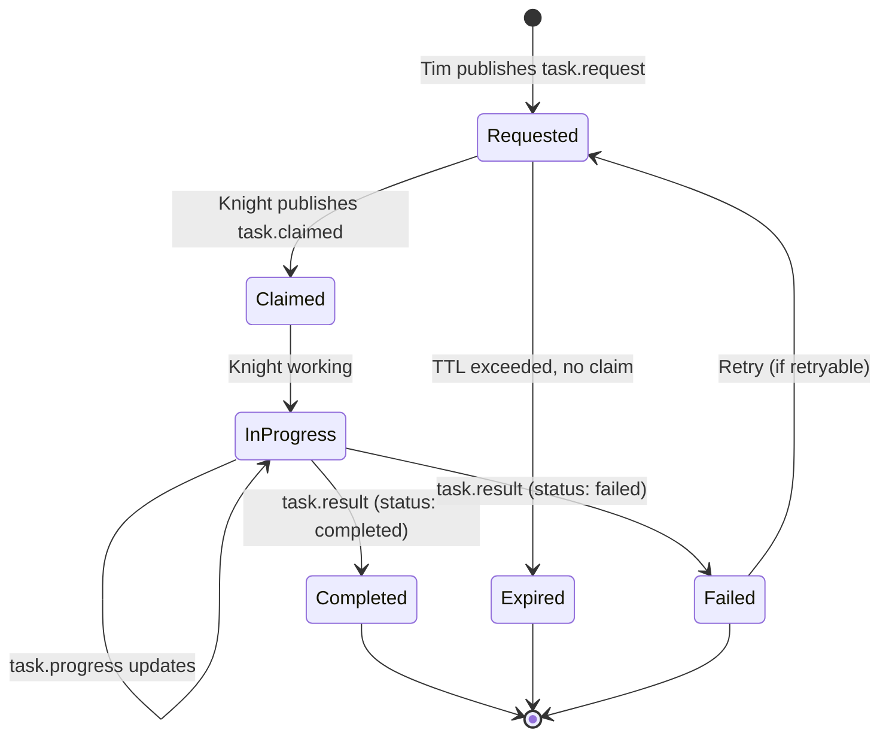

# Message Contract Specification

## Overview

All communication between agents in the Round Table flows through NATS JetStream as JSON messages. This document defines the message formats, lifecycle, and conventions.

## Message Envelope

Every message on the NATS bus follows this envelope:

```json
{
  "id": "550e8400-e29b-41d4-a716-446655440000",
  "version": "1.0",
  "type": "task.request",
  "from": "tim",
  "to": "galahad",
  "timestamp": "2026-02-08T15:00:00Z",
  "correlationId": "optional-parent-task-id",
  "priority": "normal",
  "ttl": 3600,
  "payload": {}
}
```

### Envelope Fields

| Field | Type | Required | Description |
|-------|------|----------|-------------|
| `id` | UUID v4 | ✅ | Unique message identifier |
| `version` | string | ✅ | Contract version (semver) |
| `type` | string | ✅ | Message type (see below) |
| `from` | string | ✅ | Sender agent ID |
| `to` | string | ⬚ | Target agent ID (omit for broadcast) |
| `timestamp` | ISO-8601 | ✅ | When the message was created |
| `correlationId` | UUID | ⬚ | Links related messages (e.g., result → original task) |
| `priority` | enum | ⬚ | `low`, `normal`, `high`, `critical` (default: `normal`) |
| `ttl` | integer | ⬚ | Time-to-live in seconds (default: 3600) |
| `payload` | object | ✅ | Type-specific data |

## Message Types

### `task.request`

Published by Tim (or any orchestrating agent) to assign work.

```json
{
  "id": "550e8400-e29b-41d4-a716-446655440000",
  "version": "1.0",
  "type": "task.request",
  "from": "tim",
  "to": "galahad",
  "timestamp": "2026-02-08T15:00:00Z",
  "priority": "normal",
  "ttl": 3600,
  "payload": {
    "task": "security.briefing",
    "params": {
      "scope": "daily",
      "focus": ["cve", "threat-intel", "incidents"],
      "since": "2026-02-07T00:00:00Z"
    },
    "responseFormat": "markdown",
    "maxTokens": 4000
  }
}
```

**Topic:** `roundtable.tasks.<domain>.<action>`  
**Example:** `roundtable.tasks.security.briefing`

### `task.claimed`

Published by a knight when it picks up a task. Prevents duplicate processing.

```json
{
  "id": "660e8400-e29b-41d4-a716-446655440001",
  "version": "1.0",
  "type": "task.claimed",
  "from": "galahad",
  "timestamp": "2026-02-08T15:00:01Z",
  "correlationId": "550e8400-e29b-41d4-a716-446655440000",
  "payload": {
    "estimatedDurationSeconds": 120,
    "message": "Acknowledged. Scanning threat feeds..."
  }
}
```

**Topic:** `roundtable.events.task.claimed`

### `task.progress`

Optional progress updates for long-running tasks.

```json
{
  "id": "770e8400-e29b-41d4-a716-446655440002",
  "version": "1.0",
  "type": "task.progress",
  "from": "galahad",
  "timestamp": "2026-02-08T15:00:30Z",
  "correlationId": "550e8400-e29b-41d4-a716-446655440000",
  "payload": {
    "percent": 60,
    "message": "Analyzed 3/5 threat feeds. Spawning CVE sub-agent.",
    "subTasks": [
      { "id": "sub-001", "status": "completed", "description": "RSS feed analysis" },
      { "id": "sub-002", "status": "in_progress", "description": "CVE deep dive" }
    ]
  }
}
```

**Topic:** `roundtable.events.task.progress`

### `task.result`

The final result of a completed task.

```json
{
  "id": "880e8400-e29b-41d4-a716-446655440003",
  "version": "1.0",
  "type": "task.result",
  "from": "galahad",
  "to": "tim",
  "timestamp": "2026-02-08T15:02:00Z",
  "correlationId": "550e8400-e29b-41d4-a716-446655440000",
  "payload": {
    "status": "completed",
    "result": {
      "format": "markdown",
      "content": "## Security Briefing — 2026-02-08\n\n### Critical\n- CVE-2026-1234: ...",
      "metadata": {
        "sourcesChecked": 5,
        "threatsFound": 3,
        "criticalCount": 1,
        "processingTimeMs": 119000
      }
    }
  }
}
```

**Topic:** `roundtable.results.<domain>.<task-id>`  
**Example:** `roundtable.results.security.550e8400`

### `task.failed`

When a knight cannot complete a task.

```json
{
  "id": "990e8400-e29b-41d4-a716-446655440004",
  "version": "1.0",
  "type": "task.failed",
  "from": "galahad",
  "to": "tim",
  "timestamp": "2026-02-08T15:02:00Z",
  "correlationId": "550e8400-e29b-41d4-a716-446655440000",
  "payload": {
    "error": "rate_limited",
    "message": "LLM API rate limit exceeded. Retry after 60s.",
    "retryable": true,
    "retryAfterSeconds": 60
  }
}
```

**Topic:** `roundtable.results.<domain>.<task-id>`

### `heartbeat`

Periodic health signal from each knight.

```json
{
  "id": "aa0e8400-e29b-41d4-a716-446655440005",
  "version": "1.0",
  "type": "heartbeat",
  "from": "galahad",
  "timestamp": "2026-02-08T15:00:00Z",
  "payload": {
    "status": "healthy",
    "uptime": 86400,
    "capabilities": ["security.briefing", "security.cve-analysis", "security.threat-scan"],
    "activeTaskCount": 1,
    "model": "claude-sonnet-4-20250514",
    "version": "1.0.0"
  }
}
```

**Topic:** `roundtable.heartbeat.<agent-id>`  
**Frequency:** Every 60 seconds

## Task Lifecycle



## Priority Levels

| Priority | Behavior | Use Case |
|----------|----------|----------|
| `low` | Process when idle | Background research, non-urgent scans |
| `normal` | Standard FIFO | Regular briefings, routine tasks |
| `high` | Preempt normal tasks | Urgent queries from Tim |
| `critical` | Immediate processing | Active security incidents, time-sensitive alerts |

## Error Codes

| Code | Description | Retryable |
|------|-------------|-----------|
| `rate_limited` | LLM API rate limit | ✅ |
| `timeout` | Task exceeded TTL | ✅ |
| `model_error` | LLM returned error | ✅ |
| `skill_missing` | Required skill not available | ❌ |
| `invalid_params` | Bad task parameters | ❌ |
| `internal_error` | Unexpected failure | ⚠️ Maybe |

## Versioning

The `version` field follows semver. Breaking changes increment major version. Knights should reject messages with incompatible major versions and log a warning.

## Idempotency

Task IDs (`id` field) are UUIDs. Knights must deduplicate — if a task with the same ID arrives twice (NATS redelivery), the second should be acknowledged without re-processing. Use Redis `SETNX` with the task ID for distributed deduplication.
