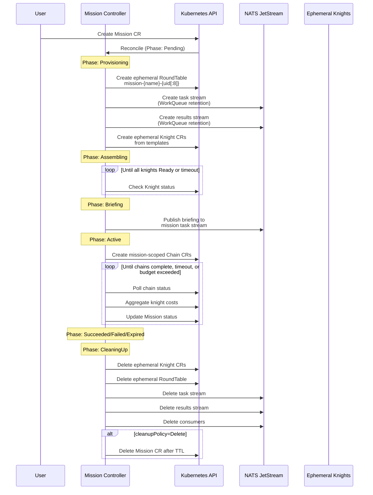
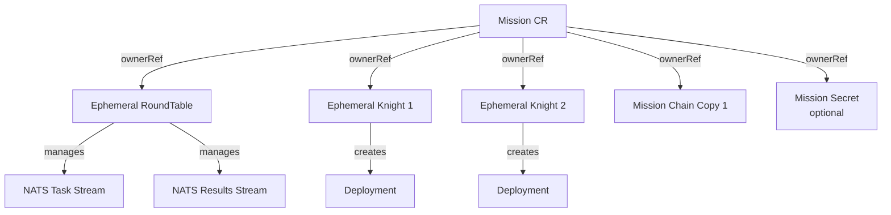
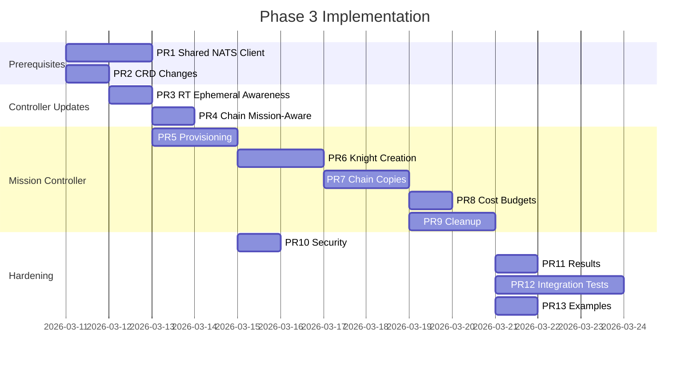

# Phase 3: Dynamic Mission Tables

**Author:** Tim the Enchanter 🔥  
**Date:** 2026-03-10  
**Status:** Design  
**CRD API Group:** `ai.roundtable.io/v1alpha1`

---

## 1. Executive Summary

Missions today are half-implemented scaffolding. The `MissionReconciler` can assemble existing knights and publish briefings, but the core value proposition — **dynamically spinning up ephemeral RoundTables with temporary knights, executing chains against them, and tearing everything down** — is stubbed out (see `mission_controller.go:133`: `"Skipping ephemeral knight (v2 feature)"`).

Phase 3 makes Missions the **Kubernetes Jobs of AI agent teams**. A Mission CR declares an objective, a roster of ephemeral knight templates, and chains to execute. The controller creates an isolated RoundTable with dedicated NATS streams, spawns ephemeral Knight CRs from templates, distributes the briefing, executes chains within the mission scope, tracks costs against a per-mission budget, collects results, and tears everything down — streams, consumers, knights, RoundTable, the lot.

**Why now:**
- Two-table split (personal + chelonian) proved NATS isolation works with WorkQueue retention
- Knights can target different streams via `NATS_TASKS_STREAM`, `NATS_RESULTS_STREAM` env vars  
- RoundTable CRD already manages fleet-level config, budgets, and policies
- WorkQueue retention auto-cleans on ack — perfect for ephemeral tables
- Limits retention causes stale accumulation — we now know to avoid it for dynamic tables

**What this enables:**
- On-demand pentest teams: spin up 5 security knights, run a coordinated assessment, get a report, tear down
- Research sprints: assemble domain experts for a time-boxed investigation
- CI/CD agent teams: create a mission per PR review, parallel knight analysis, aggregated feedback
- Cost-isolated experiments: try expensive models with hard budget caps

---

## 2. Architecture Overview



### Resource Ownership Graph



All ephemeral resources use Kubernetes `ownerReferences` pointing to the Mission CR. If the Mission is deleted, garbage collection cascades automatically.

---

## 3. CRD Changes

### 3.1 Mission Types (`api/v1alpha1/mission_types.go`)

#### New Phase: `Provisioning`

The current phase enum jumps from creation straight to `Assembling`. We need a `Provisioning` phase for RoundTable + stream creation:

```go
// MissionPhase represents the current lifecycle phase of the Mission.
// +kubebuilder:validation:Enum=Pending;Provisioning;Assembling;Briefing;Active;Succeeded;Failed;Expired;CleaningUp
type MissionPhase string

const (
    MissionPhasePending      MissionPhase = "Pending"       // NEW: initial state
    MissionPhaseProvisioning MissionPhase = "Provisioning"  // NEW: creating RT + streams
    MissionPhaseAssembling   MissionPhase = "Assembling"
    MissionPhaseBriefing     MissionPhase = "Briefing"
    MissionPhaseActive       MissionPhase = "Active"
    MissionPhaseSucceeded    MissionPhase = "Succeeded"
    MissionPhaseFailed       MissionPhase = "Failed"
    MissionPhaseExpired      MissionPhase = "Expired"
    MissionPhaseCleaningUp   MissionPhase = "CleaningUp"
)
```

#### New Fields on `MissionSpec`

```go
type MissionSpec struct {
    // ... existing fields ...

    // knightTemplates defines reusable knight configurations that can be referenced
    // by MissionKnight entries. Allows defining a template once and instantiating
    // multiple ephemeral knights from it.
    // +optional
    KnightTemplates []MissionKnightTemplate `json:"knightTemplates,omitempty"`

    // costBudgetUSD is the maximum cost for this mission. When exceeded, the mission
    // is failed and cleanup begins. "0" means inherit from parent RoundTable.
    // +kubebuilder:default="0"
    // +optional
    CostBudgetUSD string `json:"costBudgetUSD,omitempty"`

    // secrets references secrets to mount into all ephemeral knight pods.
    // Used for mission-specific credentials (e.g., target system access).
    // +optional
    Secrets []corev1.LocalObjectReference `json:"secrets,omitempty"`

    // recruitExisting, if true, allows the mission to use non-ephemeral knights
    // from the parent RoundTable alongside ephemeral ones.
    // When false (default), only ephemeral knights participate.
    // +kubebuilder:default=false
    // +optional
    RecruitExisting bool `json:"recruitExisting,omitempty"`

    // roundTableTemplate overrides defaults for the ephemeral RoundTable created
    // for this mission. If nil, sensible defaults are used.
    // +optional
    RoundTableTemplate *MissionRoundTableTemplate `json:"roundTableTemplate,omitempty"`

    // retainResults, if true, copies mission results to a ConfigMap before cleanup.
    // The ConfigMap persists beyond mission deletion for post-mortem analysis.
    // +kubebuilder:default=true
    // +optional
    RetainResults bool `json:"retainResults,omitempty"`
}
```

#### New Types

```go
// MissionKnightTemplate is a named, reusable knight spec template.
type MissionKnightTemplate struct {
    // name is the template name, referenced by MissionKnight.TemplateRef.
    // +kubebuilder:validation:Required
    Name string `json:"name"`

    // spec is the knight spec to use when creating ephemeral knights from this template.
    // +kubebuilder:validation:Required
    Spec KnightSpec `json:"spec"`
}

// MissionRoundTableTemplate configures the ephemeral RoundTable.
type MissionRoundTableTemplate struct {
    // defaults overrides for the ephemeral table's knight defaults.
    // +optional
    Defaults *RoundTableDefaults `json:"defaults,omitempty"`

    // policies overrides for the ephemeral table's policies.
    // +optional
    Policies *RoundTablePolicies `json:"policies,omitempty"`

    // natsURL overrides the NATS server URL for the mission table.
    // +optional
    NATSURL string `json:"natsURL,omitempty"`
}
```

#### Changes to `MissionKnight`

```go
type MissionKnight struct {
    // name is the knight's name within this mission.
    // For ephemeral knights, this becomes the Knight CR name (prefixed with mission name).
    // For recruited knights, this must match an existing Knight CR.
    // +kubebuilder:validation:Required
    Name string `json:"name"`

    // role describes this knight's role within the mission.
    // +optional
    Role string `json:"role,omitempty"`

    // ephemeral, if true, creates a temporary Knight for this mission.
    // Exactly one of ephemeralSpec or templateRef must be set when ephemeral=true.
    // +kubebuilder:default=false
    // +optional
    Ephemeral bool `json:"ephemeral,omitempty"`

    // ephemeralSpec defines the spec for an ephemeral knight (inline).
    // +optional
    EphemeralSpec *KnightSpec `json:"ephemeralSpec,omitempty"`

    // templateRef references a MissionKnightTemplate by name.
    // Only used when ephemeral=true. Mutually exclusive with ephemeralSpec.
    // +optional
    TemplateRef string `json:"templateRef,omitempty"`

    // specOverrides allows patching specific fields when using templateRef.
    // Applied as a strategic merge patch on top of the template spec.
    // +optional
    SpecOverrides *KnightSpecOverrides `json:"specOverrides,omitempty"`
}

// KnightSpecOverrides allows selectively overriding template fields.
type KnightSpecOverrides struct {
    // model overrides the AI model.
    // +optional
    Model string `json:"model,omitempty"`

    // skills overrides the skill list.
    // +optional
    Skills []string `json:"skills,omitempty"`

    // env adds additional environment variables.
    // +optional
    Env []corev1.EnvVar `json:"env,omitempty"`

    // prompt overrides prompt configuration.
    // +optional
    Prompt *KnightPrompt `json:"prompt,omitempty"`

    // concurrency overrides max concurrent tasks.
    // +optional
    Concurrency *int32 `json:"concurrency,omitempty"`
}
```

#### Changes to `MissionStatus`

```go
type MissionStatus struct {
    // ... existing fields ...

    // roundTableName is the name of the ephemeral RoundTable created for this mission.
    // +optional
    RoundTableName string `json:"roundTableName,omitempty"`

    // natsTasksStream is the JetStream stream name for mission tasks.
    // +optional
    NATSTasksStream string `json:"natsTasksStream,omitempty"`

    // natsResultsStream is the JetStream stream name for mission results.
    // +optional
    NATSResultsStream string `json:"natsResultsStream,omitempty"`

    // chainStatuses tracks the status of each mission chain.
    // +optional
    ChainStatuses []MissionChainStatus `json:"chainStatuses,omitempty"`

    // resultsConfigMap is the name of the ConfigMap containing preserved results
    // (only set when retainResults=true and mission is complete).
    // +optional
    ResultsConfigMap string `json:"resultsConfigMap,omitempty"`
}

// MissionChainStatus tracks a chain's status within the mission.
type MissionChainStatus struct {
    // name is the chain reference name from the spec.
    Name string `json:"name"`

    // chainCRName is the actual Chain CR name created for this mission.
    // +optional
    ChainCRName string `json:"chainCRName,omitempty"`

    // phase is the chain's current phase.
    // +optional
    Phase ChainPhase `json:"phase,omitempty"`
}
```

### 3.2 Knight Types — No Changes

The existing `KnightSpec` is already comprehensive enough. Ephemeral knights are just regular Knight CRs with owner references. The operator already handles the full lifecycle.

### 3.3 RoundTable Types — Minor Addition

```go
type RoundTableSpec struct {
    // ... existing fields ...

    // ephemeral marks this RoundTable as mission-owned. Ephemeral tables are
    // excluded from fleet-wide aggregation and are garbage collected with their mission.
    // +kubebuilder:default=false
    // +optional
    Ephemeral bool `json:"ephemeral,omitempty"`

    // missionRef is set by the mission controller when creating ephemeral tables.
    // +optional
    MissionRef string `json:"missionRef,omitempty"`
}
```

### 3.4 Chain Types — Minor Addition

```go
type ChainSpec struct {
    // ... existing fields ...

    // missionRef is set by the mission controller when creating mission-scoped chains.
    // The chain controller uses this to resolve NATS config from the mission's RoundTable.
    // +optional
    MissionRef string `json:"missionRef,omitempty"`
}
```

---

## 4. Controller Changes

### 4.1 Mission Controller — Full Rewrite

The current `MissionReconciler` needs to be restructured from a linear phase machine into a proper reconciler with sub-reconcilers for each concern.

#### RBAC Additions

```go
// +kubebuilder:rbac:groups=ai.roundtable.io,resources=roundtables,verbs=get;list;watch;create;update;patch;delete
// +kubebuilder:rbac:groups=ai.roundtable.io,resources=knights,verbs=get;list;watch;create;update;patch;delete
// +kubebuilder:rbac:groups=ai.roundtable.io,resources=chains,verbs=get;list;watch;create;update;patch;delete
// +kubebuilder:rbac:groups="",resources=configmaps,verbs=get;list;watch;create;update;patch;delete
// +kubebuilder:rbac:groups="",resources=secrets,verbs=get;list;watch
```

#### Reconciliation Loop (Detailed)

```
Reconcile(mission):
  1. Handle deletion → run finalizer (cleanup NATS streams, consumers)
  2. Add finalizer if missing
  3. If phase == "":
       Set phase = Pending, compute expiresAt, init statuses
       Return (requeue immediately)
  
  4. Check TTL expiration (all non-terminal phases):
       If expired → set phase = Expired → requeue to CleaningUp
  
  5. Check cost budget (Assembling, Briefing, Active phases):
       Sum knight costs from status
       If > costBudgetUSD → set phase = Failed (reason: BudgetExceeded) → requeue
  
  6. Switch on phase:
  
  PENDING:
    - Validate spec (templates exist, knight names unique, chains referenced exist or are inline)
    - Set phase = Provisioning
    - Requeue immediately
  
  PROVISIONING:
    - Generate mission resource names:
        roundTableName = "mission-{missionName}-{uid[:8]}"
        natsPrefix = "msn-{missionName}-{uid[:8]}"
        tasksStream = "msn_{missionName}_{uid[:8]}_tasks"
        resultsStream = "msn_{missionName}_{uid[:8]}_results"
    
    - Create ephemeral RoundTable CR:
        metadata:
          name: roundTableName
          namespace: mission.Namespace
          ownerReferences: [mission]
          labels:
            ai.roundtable.io/mission: mission.Name
            ai.roundtable.io/ephemeral: "true"
        spec:
          ephemeral: true
          missionRef: mission.Name
          nats:
            url: (from roundTableTemplate or default)
            subjectPrefix: natsPrefix
            tasksStream: tasksStream
            resultsStream: resultsStream
            createStreams: true
            streamRetention: WorkQueue  // ALWAYS WorkQueue for ephemeral
          defaults: (from roundTableTemplate or parent RT defaults)
          policies:
            costBudgetUSD: mission.Spec.CostBudgetUSD
            maxKnights: len(mission.Spec.Knights)
    
    - Wait for RoundTable phase == Ready (streams created)
    - Record stream names in mission status
    - Set phase = Assembling
    - Requeue
  
  ASSEMBLING:
    - For each MissionKnight:
        If ephemeral:
          - Resolve spec (from ephemeralSpec or templateRef + overrides)
          - Create Knight CR:
              name: "{missionName}-{knightName}"
              ownerReferences: [mission]
              labels:
                ai.roundtable.io/mission: mission.Name
                ai.roundtable.io/ephemeral: "true"
                ai.roundtable.io/round-table: roundTableName
              spec:
                (resolved from template/inline)
                nats:
                  url: (from mission RT)
                  stream: tasksStream
                  resultsStream: resultsStream
                  subjects: ["{natsPrefix}.tasks.{domain}.>"]
                  consumerName: "msn-{missionName}-{knightName}"
                suspended: false
        
        If not ephemeral (recruited):
          - Verify knight exists and is Ready
          - Verify recruitExisting == true
          - Mark as ready in status
    
    - Poll knight readiness (same as current logic, but now includes ephemeral)
    - When all ready → phase = Briefing
    - Assembly timeout: fail after Timeout/3 seconds if knights not ready
  
  BRIEFING:
    - Publish briefing payload to "{natsPrefix}.briefing" (mission stream)
    - For each knight, publish briefing as a task to their task subject
    - Set phase = Active
  
  ACTIVE:
    - Create mission-scoped Chain CRs for each chain in spec:
        name: "{missionName}-{chainRef.Name}"
        ownerReferences: [mission]
        labels:
          ai.roundtable.io/mission: mission.Name
        spec:
          (copy from referenced chain, but override):
            roundTableRef: roundTableName
            missionRef: mission.Name
            steps[].knightRef: prefix with missionName if ephemeral
    
    - Monitor chains (same as current reconcileMissionChains but using owned copies)
    - Monitor knight health
    - Aggregate costs from knight statuses
    - Update mission cost status
    
    - Completion conditions:
        All Active-phase chains succeeded → phase = Succeeded
        Any Active-phase chain failed → phase = Failed
        Timeout exceeded → phase = Failed (reason: Timeout)
        Budget exceeded → phase = Failed (reason: BudgetExceeded)
  
  SUCCEEDED / FAILED / EXPIRED:
    - If retainResults:
        Create ConfigMap with chain outputs, knight statuses, cost summary
        Record ConfigMap name in status
    - Set phase = CleaningUp
  
  CLEANING_UP:
    - Run Teardown-phase chains (if any)
    - Delete ephemeral Knight CRs (ownerRef cascade handles this, but explicit for ordering)
    - Delete NATS consumers for ephemeral knights
    - Delete NATS streams (tasks + results)
    - Delete ephemeral RoundTable
    - If cleanupPolicy == Delete && TTL expired:
        Delete the Mission CR itself
    - Else:
        Set CleanupComplete condition, stop reconciling
```

#### Watches

The mission controller needs to watch more than just Mission CRs:

```go
func (r *MissionReconciler) SetupWithManager(mgr ctrl.Manager) error {
    return ctrl.NewControllerManagedBy(mgr).
        For(&aiv1alpha1.Mission{}).
        Owns(&aiv1alpha1.RoundTable{}).   // Watch owned RoundTables
        Owns(&aiv1alpha1.Knight{}).        // Watch owned Knights
        Owns(&aiv1alpha1.Chain{}).         // Watch owned Chains
        Named("mission").
        Complete(r)
}
```

This means when an owned Knight transitions to Ready, the Mission controller automatically re-reconciles — no polling needed for assembly.

### 4.2 RoundTable Controller — Filter Ephemeral Tables

The RoundTable controller currently aggregates all knights in the namespace. Ephemeral tables should be excluded from the fleet-wide RoundTable's knight count:

```go
// In discoverKnights, add filter:
if rt.Spec.Ephemeral {
    // Ephemeral tables only manage their own mission knights
    listOpts = append(listOpts, client.MatchingLabels{
        "ai.roundtable.io/round-table": rt.Name,
    })
}
```

### 4.3 Chain Controller — Mission-Aware NATS Resolution

Currently the chain controller hardcodes `natsURL` (line 25). When `spec.missionRef` is set, it should resolve NATS config from the mission's RoundTable:

```go
func (r *ChainReconciler) resolveNATSConfig(ctx context.Context, chain *aiv1alpha1.Chain) (string, string, string, error) {
    if chain.Spec.MissionRef != "" {
        // Look up the mission, get its RoundTable, use those streams
        mission := &aiv1alpha1.Mission{}
        if err := r.Get(ctx, types.NamespacedName{
            Name: chain.Spec.MissionRef, Namespace: chain.Namespace,
        }, mission); err != nil {
            return "", "", "", err
        }
        rt := &aiv1alpha1.RoundTable{}
        if err := r.Get(ctx, types.NamespacedName{
            Name: mission.Status.RoundTableName, Namespace: chain.Namespace,
        }, rt); err != nil {
            return "", "", "", err
        }
        return rt.Spec.NATS.URL, rt.Spec.NATS.TasksStream, rt.Spec.NATS.ResultsStream, nil
    }
    // Fall back to roundTableRef or default
    // ...
}
```

### 4.4 Shared NATS Client (Prerequisite — addresses architecture review I1)

Before Phase 3, extract NATS logic into `internal/nats/client.go`:

```go
package nats

type Client struct {
    nc *nats.Conn
    js nats.JetStreamContext
    mu sync.Mutex
}

func (c *Client) EnsureStream(name string, subjects []string, retention nats.RetentionPolicy) error
func (c *Client) DeleteStream(name string) error
func (c *Client) DeleteConsumer(stream, consumer string) error  
func (c *Client) Publish(subject string, data []byte) error
func (c *Client) CreateOrderedConsumer(stream string, filterSubject string) (*nats.Subscription, error)
```

All controllers share one `*nats.Client` injected from `cmd/main.go`.

---

## 5. NATS Stream Lifecycle

### Creation

During `Provisioning`, the mission controller creates streams via the ephemeral RoundTable's `createStreams: true`. The RoundTable controller handles the actual NATS API calls (reusing existing `ensureStreams()` at `roundtable_controller.go:120`).

**Naming convention:**
```
Stream:  msn_{missionName}_{uid8}_tasks     / msn_{missionName}_{uid8}_results
Subject: msn-{missionName}-{uid8}.tasks.>   / msn-{missionName}-{uid8}.results.>
```

Underscores in stream names (NATS requirement), hyphens in subject prefixes (convention).

### Configuration

```go
&nats.StreamConfig{
    Name:       streamName,
    Subjects:   []string{subjectPattern},
    Retention:  nats.WorkQueuePolicy,  // ALWAYS WorkQueue — proven correct for ephemeral
    Storage:    nats.FileStorage,
    MaxAge:     time.Duration(mission.Spec.TTL) * time.Second * 2,  // 2x TTL safety margin
    Discard:    nats.DiscardOld,
    MaxMsgs:    10000,                 // Safety cap — missions shouldn't produce more
}
```

**Why WorkQueue:** We proved today that WorkQueue retention auto-cleans messages on ack. Limits retention causes stale task accumulation. For ephemeral tables that exist for minutes to hours, WorkQueue is the only correct choice.

### Isolation

Each mission gets its own streams with unique subject prefixes. No cross-mission message leakage is possible because:
1. Stream subjects are scoped: `msn-{name}-{uid}.tasks.>` 
2. Knight consumers filter on their mission's prefix
3. Even if two missions have the same name (different UIDs), the uid segment prevents collision

### Teardown

During `CleaningUp`:

```go
// 1. Delete all consumers first (prevents "stream has consumers" errors)
for _, knight := range mission.Status.KnightStatuses {
    natsClient.DeleteConsumer(tasksStream, knight.ConsumerName)
}

// 2. Delete streams
natsClient.DeleteStream(mission.Status.NATSTasksStream)
natsClient.DeleteStream(mission.Status.NATSResultsStream)
```

If NATS is unreachable during cleanup, the controller retries with exponential backoff. The `MaxAge` on streams provides a safety net — even if cleanup fails, streams auto-expire at 2x TTL.

---

## 6. Ephemeral Knight Lifecycle

### Spawn from Template

Two paths to define an ephemeral knight's spec:

**Path A — Inline spec:**
```yaml
knights:
  - name: scanner
    ephemeral: true
    ephemeralSpec:
      domain: security
      model: claude-sonnet-4-20250514
      skills: [security, shared]
      nats: {}  # Controller fills in mission NATS config
```

**Path B — Template reference with overrides:**
```yaml
knightTemplates:
  - name: security-base
    spec:
      domain: security
      model: claude-sonnet-4-20250514
      skills: [security, shared]
      tools:
        nix: [nmap, nikto]
      resources:
        memory: 512Mi
        cpu: 500m

knights:
  - name: scanner-1
    ephemeral: true
    templateRef: security-base
  - name: scanner-2
    ephemeral: true
    templateRef: security-base
    specOverrides:
      model: claude-haiku-35-20241022  # cheaper for parallel scanning
```

**Decision: Templates live in the Mission CR, not as separate CRs.** Rationale: Mission templates are mission-scoped and ephemeral. Creating separate CRDs for templates adds complexity without value. If we need shared templates later, we can add a `KnightTemplate` CRD in Phase 4.

### Configure

The mission controller fills in NATS configuration before creating the Knight CR:

```go
func (r *MissionReconciler) buildEphemeralKnight(mission *Mission, mk MissionKnight, rt *RoundTable) *Knight {
    spec := resolveKnightSpec(mission, mk) // inline or template+overrides
    
    // Override NATS config to point at mission streams
    spec.NATS = KnightNATS{
        URL:           rt.Spec.NATS.URL,
        Stream:        rt.Spec.NATS.TasksStream,
        ResultsStream: rt.Spec.NATS.ResultsStream,
        Subjects:      []string{fmt.Sprintf("%s.tasks.%s.>", rt.Spec.NATS.SubjectPrefix, spec.Domain)},
        ConsumerName:  fmt.Sprintf("msn-%s-%s", mission.Name, mk.Name),
        MaxDeliver:    1,
    }
    
    // Inject mission secrets
    for _, s := range mission.Spec.Secrets {
        spec.EnvFrom = append(spec.EnvFrom, corev1.EnvFromSource{
            SecretRef: &corev1.SecretEnvSource{
                LocalObjectReference: s,
            },
        })
    }
    
    // No workspace PVC for ephemeral knights (stateless)
    spec.Workspace = nil
    
    return &Knight{
        ObjectMeta: metav1.ObjectMeta{
            Name:      fmt.Sprintf("%s-%s", mission.Name, mk.Name),
            Namespace: mission.Namespace,
            Labels: map[string]string{
                "ai.roundtable.io/mission":     mission.Name,
                "ai.roundtable.io/ephemeral":   "true",
                "ai.roundtable.io/round-table": mission.Status.RoundTableName,
                "ai.roundtable.io/role":        mk.Role,
            },
            OwnerReferences: []metav1.OwnerReference{missionOwnerRef(mission)},
        },
        Spec: *spec,
    }
}
```

### Monitor

The mission controller watches owned Knight CRs (via `Owns(&Knight{})`). No polling needed. When a knight transitions to `Ready`, the controller re-reconciles.

Health monitoring during the Active phase checks for knight degradation:

```go
// If an ephemeral knight enters Degraded phase during Active, restart it
if knight.Status.Phase == KnightPhaseDegraded && mk.Ephemeral {
    // Delete and recreate — ephemeral knights are cattle, not pets
    r.Delete(ctx, knight)
    // Reconcile loop will recreate on next pass
}
```

### Cleanup

Ephemeral knights are cleaned up via owner reference cascade when the Mission CR's finalizer runs. However, the controller explicitly deletes them in order for a clean shutdown:

1. Scale knight deployments to 0 (graceful drain)
2. Wait for pods to terminate (60s timeout)
3. Delete Knight CRs
4. Delete NATS consumers

---

## 7. Chain Integration

### Mission-Scoped Chain Copies

The current mission controller references chains by name but doesn't create copies (`mission_controller.go:240`: `_ = chainName`). This is wrong — running a mission chain modifies the Chain CR's status, which would conflict with scheduled runs.

**Phase 3 approach:** The mission controller creates owned copies of referenced chains with mission-scoped configuration.

```go
func (r *MissionReconciler) createMissionChain(ctx context.Context, mission *Mission, ref MissionChainRef) error {
    // Fetch the template chain
    sourceChain := &Chain{}
    if err := r.Get(ctx, types.NamespacedName{
        Name: ref.Name, Namespace: mission.Namespace,
    }, sourceChain); err != nil {
        return err
    }
    
    missionChain := &Chain{
        ObjectMeta: metav1.ObjectMeta{
            Name:      fmt.Sprintf("%s-%s", mission.Name, ref.Name),
            Namespace: mission.Namespace,
            Labels: map[string]string{
                "ai.roundtable.io/mission": mission.Name,
            },
            OwnerReferences: []metav1.OwnerReference{missionOwnerRef(mission)},
        },
        Spec: ChainSpec{
            Description:   fmt.Sprintf("Mission %s: %s", mission.Name, sourceChain.Spec.Description),
            Steps:         r.remapChainSteps(mission, sourceChain.Spec.Steps),
            Timeout:       min(sourceChain.Spec.Timeout, mission.Spec.Timeout),
            RoundTableRef: mission.Status.RoundTableName,
            MissionRef:    mission.Name,
            // No schedule — mission chains run once
        },
    }
    
    if ref.InputOverride != "" {
        missionChain.Spec.Input = ref.InputOverride
    } else {
        missionChain.Spec.Input = sourceChain.Spec.Input
    }
    
    return r.Create(ctx, missionChain)
}

// remapChainSteps prefixes knightRef with mission name for ephemeral knights
func (r *MissionReconciler) remapChainSteps(mission *Mission, steps []ChainStep) []ChainStep {
    ephemeralNames := map[string]bool{}
    for _, mk := range mission.Spec.Knights {
        if mk.Ephemeral {
            ephemeralNames[mk.Name] = true
        }
    }
    
    remapped := make([]ChainStep, len(steps))
    for i, step := range steps {
        remapped[i] = step
        if ephemeralNames[step.KnightRef] {
            remapped[i].KnightRef = fmt.Sprintf("%s-%s", mission.Name, step.KnightRef)
        }
    }
    return remapped
}
```

### Chain Execution Order

Chains have a `Phase` field in `MissionChainRef`: `Setup`, `Active`, `Teardown`.

1. **Setup chains** run first during the `Active` phase transition. Must all succeed before Active chains start.
2. **Active chains** run concurrently. Mission succeeds when all succeed.
3. **Teardown chains** run during `CleaningUp`, even if the mission failed.

---

## 8. Cost Tracking & Budgets

### Per-Mission Cost Aggregation

The mission controller aggregates costs from ephemeral knight statuses:

```go
func (r *MissionReconciler) aggregateCosts(ctx context.Context, mission *Mission) (float64, error) {
    var total float64
    for _, ks := range mission.Status.KnightStatuses {
        if !ks.Ephemeral {
            continue // Don't count recruited knight costs against mission budget
        }
        knight := &Knight{}
        if err := r.Get(ctx, types.NamespacedName{
            Name: fmt.Sprintf("%s-%s", mission.Name, ks.Name),
            Namespace: mission.Namespace,
        }, knight); err != nil {
            continue
        }
        if cost, err := strconv.ParseFloat(knight.Status.TotalCost, 64); err == nil {
            total += cost
        }
    }
    return total, nil
}
```

### Kill Switch

When cost exceeds budget:

1. Set mission phase to `Failed` with reason `BudgetExceeded`
2. Immediately suspend all ephemeral knights (`spec.suspended = true`)
3. Transition to `CleaningUp`

The budget check runs every reconciliation cycle during Active phase (triggered by knight status changes via the `Owns` watch).

### Cost Reporting

Mission status includes running cost. The results ConfigMap (when `retainResults: true`) includes a cost breakdown:

```json
{
  "totalCost": "1.2345",
  "knightCosts": {
    "scanner-1": "0.5432",
    "scanner-2": "0.4321",
    "analyst": "0.2592"
  },
  "budgetUsed": "61.7%"
}
```

---

## 9. Failure Modes

| Failure | Detection | Response |
|---------|-----------|----------|
| Knight pod crash (OOMKill, panic) | Knight phase → Degraded (deployment reports unavailable) | Delete and recreate ephemeral knight. Retry count tracked. After 3 recreations, fail the mission. |
| Knight never becomes Ready | Assembly timeout (Timeout/3 seconds) | Fail mission with reason `AssemblyTimeout`. List unready knights in status. |
| Mission timeout | `time.Since(startedAt) > Timeout` checked every reconcile | Fail mission with reason `Timeout`. Begin cleanup. |
| Budget exceeded | Cost aggregation > costBudgetUSD | Suspend all knights immediately. Fail mission with reason `BudgetExceeded`. |
| NATS unreachable during provisioning | RoundTable stays in `Provisioning` (streams can't be created) | Retry with backoff. Mission stays in `Provisioning`. TTL still applies — will expire if NATS never recovers. |
| NATS unreachable during cleanup | Stream/consumer deletion fails | Retry with exponential backoff. `MaxAge` on streams provides safety net. Log warning and mark cleanup as degraded. |
| Chain step fails | Chain controller marks chain as Failed | If `continueOnFailure` on the chain, continue. Otherwise fail the mission. |
| Referenced chain template not found | Validation in `Pending` phase | Fail mission immediately with reason `ChainNotFound`. |
| Ephemeral RoundTable fails to provision | RT stays in `Provisioning` | Retry. Assembly timeout covers this case. |
| Mission CR deleted during Active phase | Finalizer triggers | Run cleanup: suspend knights, delete streams, delete owned resources. |
| Operator pod restart during Active mission | Normal reconcile resumes from persisted phase | All state is in CRD status fields. Reconcile picks up where it left off. NATS consumers with `MaxDeliver: 1` prevent duplicate task delivery. |

---

## 10. Security Considerations

### RBAC for Ephemeral Knights

**Decision: Ephemeral knights stay in the `roundtable` namespace.** Rationale:
- Creating per-mission namespaces adds 10-15 seconds of latency and requires cluster-scoped RBAC
- Owner references don't work cross-namespace
- NATS isolation already provides the security boundary we need

Ephemeral knights get a mission-scoped ServiceAccount:

```go
// Created during Provisioning
sa := &corev1.ServiceAccount{
    ObjectMeta: metav1.ObjectMeta{
        Name:            fmt.Sprintf("msn-%s", mission.Name),
        Namespace:       mission.Namespace,
        OwnerReferences: []metav1.OwnerReference{missionOwnerRef(mission)},
    },
}
```

This SA has **no RBAC bindings by default**. Knights don't need K8s API access — they communicate via NATS. If a mission needs K8s access (e.g., infra assessment), the Mission spec can reference a pre-existing Role.

### Network Isolation

**Phase 3 adds NetworkPolicies** (addresses architecture review N2):

```yaml
apiVersion: networking.k8s.io/v1
kind: NetworkPolicy
metadata:
  name: mission-{name}-isolation
  ownerReferences: [mission]
spec:
  podSelector:
    matchLabels:
      ai.roundtable.io/mission: {name}
  policyTypes: [Egress]
  egress:
    - to:
        - namespaceSelector:
            matchLabels:
              kubernetes.io/metadata.name: database
          podSelector:
            matchLabels:
              app.kubernetes.io/name: nats
      ports:
        - port: 4222
    - to:  # Anthropic API via DNS
        - namespaceSelector: {}
          podSelector:
            matchLabels:
              k8s-app: kube-dns
      ports:
        - port: 53
          protocol: UDP
    # Additional egress rules from mission.Spec can be injected
```

### Secret Scoping

Mission secrets (`mission.Spec.Secrets`) are mounted as env vars only on ephemeral knights owned by that mission. They are never accessible to recruited (non-ephemeral) knights.

The mission controller validates that referenced secrets exist during the `Pending` phase.

---

## 11. Migration Path

### Phase 3a — Prerequisites (no breaking changes)

1. **Extract shared NATS client** (`internal/nats/`) — refactor all three controllers
2. **Add `ephemeral` and `missionRef` fields** to RoundTable and Chain specs (additive, optional)
3. **Fix chain controller NATS resolution** — read from RoundTable instead of hardcoded URL
4. **Add `Pending` and `Provisioning` phases** to Mission enum (additive)
5. **Update RoundTable controller** to skip ephemeral tables in fleet aggregation

All existing CRs continue to work. New fields have defaults. No migration needed.

### Phase 3b — Mission Controller Rewrite

1. **Implement provisioning** (RoundTable + stream creation)
2. **Implement ephemeral knight creation** from templates
3. **Implement mission-scoped chain copies**
4. **Implement cost budget enforcement**
5. **Implement cleanup with stream deletion**

Existing missions (if any) will need their status reset since the phase enum changes. Since missions are ephemeral by nature, this is a non-issue — just delete and recreate.

### Phase 3c — Hardening

1. **NetworkPolicy generation**
2. **Results ConfigMap preservation**
3. **Mission-scoped ServiceAccounts**
4. **Integration tests**

---

## 12. Implementation Plan

### PR 1: Shared NATS Client (Prerequisite)
**Depends on:** Nothing  
**Files:** `internal/nats/client.go`, refactor all controllers  
**Effort:** 1-2 days  
**Issue:** `Extract shared NATS client library`

### PR 2: CRD Type Changes
**Depends on:** Nothing (can parallel with PR 1)  
**Files:** `api/v1alpha1/mission_types.go`, `roundtable_types.go`, `chain_types.go`  
**Effort:** 1 day  
**Issue:** `Add Phase 3 CRD fields for dynamic missions`

### PR 3: RoundTable Controller — Ephemeral Awareness
**Depends on:** PR 2  
**Files:** `internal/controller/roundtable_controller.go`  
**Effort:** 0.5 day  
**Issue:** `Filter ephemeral RoundTables from fleet aggregation`

### PR 4: Chain Controller — Mission-Aware NATS
**Depends on:** PR 1, PR 2  
**Files:** `internal/controller/chain_controller.go`  
**Effort:** 1 day  
**Issue:** `Resolve NATS config from RoundTable/Mission refs`

### PR 5: Mission Controller — Provisioning Phase
**Depends on:** PR 1, PR 2, PR 3  
**Files:** `internal/controller/mission_controller.go`  
**Effort:** 2 days  
**Issue:** `Implement Mission provisioning (ephemeral RoundTable + NATS streams)`

### PR 6: Mission Controller — Ephemeral Knight Creation
**Depends on:** PR 5  
**Files:** `internal/controller/mission_controller.go`  
**Effort:** 2 days  
**Issue:** `Implement ephemeral knight creation from templates`

### PR 7: Mission Controller — Chain Copies & Active Phase
**Depends on:** PR 4, PR 6  
**Files:** `internal/controller/mission_controller.go`  
**Effort:** 2 days  
**Issue:** `Implement mission-scoped chain copies and active monitoring`

### PR 8: Mission Controller — Cost Budgets & Kill Switch
**Depends on:** PR 7  
**Files:** `internal/controller/mission_controller.go`  
**Effort:** 1 day  
**Issue:** `Implement per-mission cost tracking with budget enforcement`

### PR 9: Mission Controller — Cleanup & Stream Teardown
**Depends on:** PR 7  
**Files:** `internal/controller/mission_controller.go`  
**Effort:** 1-2 days  
**Issue:** `Implement mission cleanup with NATS stream deletion`

### PR 10: Security — NetworkPolicies & ServiceAccounts
**Depends on:** PR 5  
**Files:** `internal/controller/mission_controller.go`  
**Effort:** 1 day  
**Issue:** `Add mission-scoped NetworkPolicies and ServiceAccounts`

### PR 11: Results Preservation
**Depends on:** PR 9  
**Files:** `internal/controller/mission_controller.go`  
**Effort:** 0.5 day  
**Issue:** `Preserve mission results in ConfigMap`

### PR 12: Integration Tests
**Depends on:** PR 9  
**Files:** `internal/controller/mission_controller_test.go`  
**Effort:** 2-3 days  
**Issue:** `E2E tests for mission lifecycle with embedded NATS`

### PR 13: Example Missions
**Depends on:** PR 9  
**Files:** `config/samples/`, `docs/`  
**Effort:** 1 day  
**Issue:** `Add example Mission CRs for pentest, research sprint, code review`

**Total estimated effort: 15-20 days**



---

## 13. Open Questions

### Decided

| Question | Decision | Rationale |
|----------|----------|-----------|
| Ephemeral knights: own namespace or same namespace? | **Same namespace** (`roundtable`) | Owner references don't work cross-namespace. NATS provides isolation. |
| Mission table naming? | **`mission-{name}-{uid[:8]}`** | Deterministic, collision-resistant, human-readable. |
| Knight templates: inline or separate CRD? | **Inline in Mission CR** | Templates are mission-scoped. Separate CRD adds complexity without value for Phase 3. |
| Briefing distribution? | **NATS publish** (not ConfigMap) | Knights already consume from NATS. ConfigMap mount requires pod restart. |
| Can missions recruit existing knights? | **Yes, opt-in** via `recruitExisting: true` | Enables hybrid missions (expert knight + ephemeral team). |
| Mission-level secrets? | **Yes**, via `spec.secrets` | Essential for pentest missions, API key scoping. |

### Still Open

1. **Garbage collection TTL for completed missions** — Should we add a separate `completedTTL` (time after completion before self-deletion), distinct from the existing `TTL` (absolute time-to-live)? Current design uses TTL for both.

2. **Mission-to-mission communication** — If two missions run concurrently, should they be able to communicate via NATS? Current design says no (full isolation). But a "parent mission spawning child missions" pattern might want this.

3. **Ephemeral knight workspace** — Current design gives ephemeral knights no workspace PVC (stateless). Some missions might need persistent scratch space. Add an `ephemeralWorkspace: true` option that creates a temporary emptyDir or PVC?

4. **Knight pool / warm standby** — Creating a knight takes 30-60 seconds (image pull, nix build, git-sync). Should we support pre-warmed knight pools? This is likely Phase 4 but worth noting.

5. **Mission observation / live streaming** — How do humans observe a running mission in real-time? The UI dashboard needs mission-aware views. Should we add a mission WebSocket endpoint that fans out all mission NATS traffic?

6. **Mission chaining** — Can a mission's output trigger another mission? E.g., reconnaissance mission → assessment mission. This is "workflows" territory and might belong in Phase 4.

---

## Appendix A: Example Mission CR

```yaml
apiVersion: ai.roundtable.io/v1alpha1
kind: Mission
metadata:
  name: vulnweb-assessment
  namespace: roundtable
spec:
  objective: "Conduct a comprehensive security assessment of the VulnWeb test target"
  
  successCriteria: "Generate a prioritized vulnerability report with remediation recommendations"
  
  roundTableRef: personal  # Parent table for policy inheritance
  
  costBudgetUSD: "5.00"
  ttl: 7200      # 2 hours
  timeout: 3600  # 1 hour active time
  
  briefing: |
    You are part of a security assessment team. Your target is the VulnWeb
    application at http://vulnweb.chelonianlabs.com.
    
    Rules of engagement:
    - Only test the specified target
    - Do not attempt denial-of-service attacks
    - Document all findings with evidence
    - Coordinate with your team via the mission NATS subjects
  
  secrets:
    - name: vulnweb-target-creds
  
  knightTemplates:
    - name: security-scanner
      spec:
        domain: security
        model: claude-sonnet-4-20250514
        skills: [security, shared]
        tools:
          nix: [nmap, nikto, sqlmap, gobuster]
        resources:
          memory: 512Mi
          cpu: 500m
        concurrency: 3
        taskTimeout: 300
  
  knights:
    - name: recon
      role: reconnaissance
      ephemeral: true
      templateRef: security-scanner
    
    - name: webapp
      role: web-application-testing
      ephemeral: true
      templateRef: security-scanner
      specOverrides:
        tools:
          nix: [nmap, nikto, sqlmap, zap-cli, httpie]
    
    - name: analyst
      role: analysis-and-reporting
      ephemeral: true
      ephemeralSpec:
        domain: security
        model: claude-sonnet-4-20250514
        skills: [security, writing, shared]
        concurrency: 1
        taskTimeout: 600
  
  chains:
    - name: pentest-vulnweb
      phase: Active
      inputOverride: '{"target": "http://vulnweb.chelonianlabs.com"}'
  
  cleanupPolicy: Delete
  retainResults: true
```

## Appendix B: Generated Resources

For the above mission, the controller creates:

```
Mission: vulnweb-assessment
├── RoundTable: mission-vulnweb-assessment-a1b2c3d4
│   ├── NATS Stream: msn_vulnweb_assessment_a1b2c3d4_tasks
│   └── NATS Stream: msn_vulnweb_assessment_a1b2c3d4_results
├── Knight: vulnweb-assessment-recon
│   └── Deployment: vulnweb-assessment-recon
├── Knight: vulnweb-assessment-webapp
│   └── Deployment: vulnweb-assessment-webapp
├── Knight: vulnweb-assessment-analyst
│   └── Deployment: vulnweb-assessment-analyst
├── Chain: vulnweb-assessment-pentest-vulnweb
├── ServiceAccount: msn-vulnweb-assessment
├── NetworkPolicy: mission-vulnweb-assessment-isolation
└── ConfigMap: vulnweb-assessment-results (after completion)
```

---

*"What... is your quest?" "To seek the Dynamic Mission Tables!" "What... is the airspeed velocity of an ephemeral knight?" "WorkQueue retention or Limits retention?" "...WorkQueue! Definitely WorkQueue!"* 🔥
