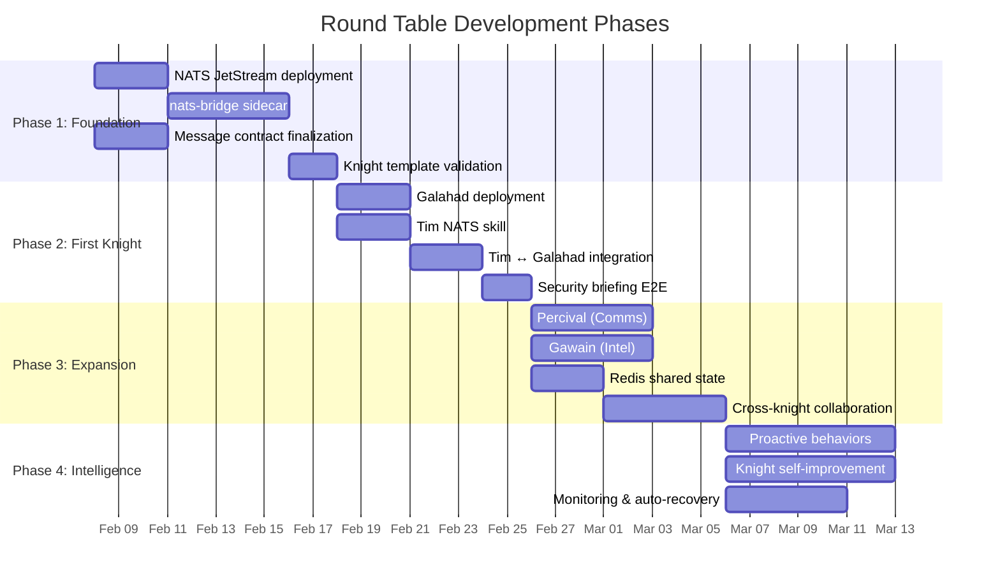

# Project Roadmap

## Phase Overview

## Phase 1: Foundation 🏗️

**Goal:** Deploy core infrastructure and validate the communication pattern.

### Deliverables

- [ ] **NATS JetStream** deployed to `roundtable` namespace via Flux HelmRelease
  - Single-node StatefulSet
  - JetStream enabled with file storage
  - 4 streams configured (tasks, results, events, heartbeat)
- [ ] **nats-bridge sidecar** built and published
  - Go binary with NATS ↔ HTTP webhook bridging
  - Docker image in GitHub Container Registry
  - Health check endpoint
  - Graceful shutdown
  - Configurable via environment variables
- [ ] **Message contract** finalized and documented
  - Envelope schema validated with JSON Schema
  - All message types defined with examples
  - Error codes and retry semantics agreed
- [ ] **Knight template** validated
  - Kustomize base that deploys OpenClaw + nats-bridge
  - Workspace PVC mounting
  - Environment variable configuration
  - Tested with a dummy "echo" knight

### Success Criteria
A dummy knight can receive a task from NATS, process it through OpenClaw, and return a result — all within the K8s cluster.

---

## Phase 2: First Knight ⚔️

**Goal:** Galahad (Security) operational and integrated with Tim.

### Deliverables

- [ ] **Galahad deployed** with security-focused personality and skills
  - SOUL.md: Security analyst personality
  - Skills: RSS analysis, CVE lookup, threat intel aggregation
  - Model: Claude Sonnet (cost-efficient for analysis)
- [ ] **Tim's NATS skill** installed and working
  - Publish tasks to NATS from Tim's session
  - Subscribe to results
  - Helper scripts for common patterns
- [ ] **End-to-end security briefing**
  - Tim requests briefing → Galahad produces it → Tim presents to User
  - Compared against current monolithic briefing quality
  - Latency benchmarked

### Success Criteria
User asks Tim for a security briefing. Tim delegates to Galahad via NATS. Galahad analyzes threats and returns structured data. Tim synthesizes and presents. User doesn't know or care that Galahad was involved.

---

## Phase 3: Expansion 🌍

**Goal:** Multiple knights operational, cross-domain collaboration proven.

### Deliverables

- [ ] **Percival (Communications)** deployed
  - Email triage via Outlook Bridge
  - Notification prioritization
  - Draft responses
- [ ] **Gawain (Intelligence)** deployed
  - Weather, news, market summaries
  - OSINT capabilities
  - Relevance filtering (learns what User cares about)
- [ ] **Redis shared state** operational
  - Agent registry (who's alive, capabilities)
  - Cross-knight context sharing
  - Task deduplication
- [ ] **Composite daily briefing**
  - Tim publishes parallel requests to Galahad + Percival + Gawain
  - Collects all results
  - Synthesizes into one coherent morning briefing
  - Delivered via User's preferred channel

### Success Criteria
Morning briefing pulls from 3+ knights in parallel, synthesized by Tim into a single coherent delivery. Adding a 4th source requires only deploying a new knight — no changes to Tim's config.

---

## Phase 4: Intelligence 🧠

**Goal:** Knights become proactive, self-improving, and resilient.

### Deliverables

- [ ] **Proactive behaviors**
  - Knights trigger on events, not just requests (e.g., Galahad reacts to a new CVE alert)
  - Cron-based periodic tasks (Galahad scans feeds every 4 hours)
  - Event-driven chains (Galahad finds critical CVE → notifies Tim → Tim alerts User)
- [ ] **Knight self-improvement**
  - Knights maintain MEMORY.md with domain knowledge
  - Learn from past tasks (what was useful, what wasn't)
  - Adjust behavior based on feedback
- [ ] **Monitoring & auto-recovery**
  - Heartbeat monitoring — Tim knows which knights are alive
  - Auto-restart via K8s liveness probes
  - Degraded mode — Tim works without knights if NATS is down
  - Prometheus metrics from nats-bridge
- [ ] **Munin integration**
  - Munin can request knight services (through Tim or directly via NATS)
  - User B benefits from the Round Table without knowing it exists

### Success Criteria
The system runs autonomously for a week. Knights proactively surface relevant info. If a knight dies, Tim notices and adapts. New knights can be added by commit + push with zero downtime.

---

## Future Considerations

- **Local LLM inference** on the P100 GPUs for cost-sensitive knights
- **Vector database** for knight long-term memory (Qdrant/Weaviate)
- **Web UI dashboard** for monitoring knight status and task history
- **kagent CRDs** for native K8s lifecycle management if the project matures
- **Multi-cluster** support if the lab expands
