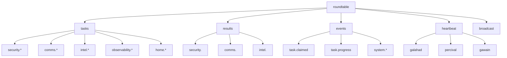

# NATS Topic Conventions

## Topic Hierarchy



## Subject Format

```
roundtable.<category>.<domain>.<action|id>
```

### Categories

| Category | Purpose | Pattern |
|----------|---------|---------|
| `tasks` | Task requests from orchestrator to knights | `roundtable.tasks.<domain>.<action>` |
| `results` | Task results from knights back to orchestrator | `roundtable.results.<domain>.<task-id>` |
| `events` | System events, lifecycle, progress | `roundtable.events.<event-type>` |
| `heartbeat` | Agent health signals | `roundtable.heartbeat.<agent-id>` |
| `broadcast` | Messages to all agents | `roundtable.broadcast.<topic>` |

## Domain Subjects

### Security (Galahad)

| Subject | Direction | Description |
|---------|-----------|-------------|
| `roundtable.tasks.security.briefing` | Tim → Galahad | Daily security briefing |
| `roundtable.tasks.security.cve-analysis` | Tim → Galahad | Deep dive on specific CVE |
| `roundtable.tasks.security.threat-scan` | Tim → Galahad | Scan specific threat feeds |
| `roundtable.tasks.security.incident` | Tim → Galahad | Analyze a security incident |
| `roundtable.results.security.*` | Galahad → Tim | All security results |

### Communications (Percival)

| Subject | Direction | Description |
|---------|-----------|-------------|
| `roundtable.tasks.comms.email-triage` | Tim → Percival | Scan and prioritize emails |
| `roundtable.tasks.comms.email-draft` | Tim → Percival | Draft an email response |
| `roundtable.tasks.comms.notifications` | Tim → Percival | Check notification channels |
| `roundtable.results.comms.*` | Percival → Tim | All comms results |

### Intelligence (Gawain)

| Subject | Direction | Description |
|---------|-----------|-------------|
| `roundtable.tasks.intel.weather` | Tim → Gawain | Weather report |
| `roundtable.tasks.intel.news` | Tim → Gawain | News summary |
| `roundtable.tasks.intel.market` | Tim → Gawain | Market/financial data |
| `roundtable.tasks.intel.research` | Tim → Gawain | General research task |
| `roundtable.results.intel.*` | Gawain → Tim | All intel results |

### Observability (Tristan)

| Subject | Direction | Description |
|---------|-----------|-------------|
| `roundtable.tasks.observability.health` | Tim → Tristan | Cluster health check |
| `roundtable.tasks.observability.alert` | Tim → Tristan | Investigate an alert |
| `roundtable.tasks.observability.capacity` | Tim → Tristan | Capacity planning report |
| `roundtable.results.observability.*` | Tristan → Tim | All observability results |

### Home Automation (Lancelot)

| Subject | Direction | Description |
|---------|-----------|-------------|
| `roundtable.tasks.home.scene` | Tim → Lancelot | Activate a scene/routine |
| `roundtable.tasks.home.status` | Tim → Lancelot | Home status report |
| `roundtable.tasks.home.automation` | Tim → Lancelot | Manage automations |
| `roundtable.results.home.*` | Lancelot → Tim | All home results |

## System Events

| Subject | Description |
|---------|-------------|
| `roundtable.events.task.claimed` | A knight claimed a task |
| `roundtable.events.task.progress` | Task progress update |
| `roundtable.events.system.knight-online` | A knight pod started |
| `roundtable.events.system.knight-offline` | A knight pod stopped |
| `roundtable.events.system.error` | System-level errors |

## Broadcast Subjects

| Subject | Description |
|---------|-------------|
| `roundtable.broadcast.config-update` | Configuration change notification |
| `roundtable.broadcast.maintenance` | Maintenance mode toggle |
| `roundtable.broadcast.alert` | Urgent alert to all agents |

## JetStream Stream Configuration

### ROUNDTABLE_TASKS

```yaml
name: ROUNDTABLE_TASKS
subjects:
  - "roundtable.tasks.>"
retention: workqueue      # Each message consumed once
maxAge: 86400000000000    # 24h TTL (nanoseconds)
storage: file
replicas: 1               # Single node for homelab
maxMsgSize: 1048576       # 1MB max message
discard: old
```

### ROUNDTABLE_RESULTS

```yaml
name: ROUNDTABLE_RESULTS
subjects:
  - "roundtable.results.>"
retention: limits
maxAge: 604800000000000   # 7 day retention
storage: file
replicas: 1
maxMsgSize: 4194304       # 4MB (results can be larger)
discard: old
```

### ROUNDTABLE_EVENTS

```yaml
name: ROUNDTABLE_EVENTS
subjects:
  - "roundtable.events.>"
retention: limits
maxAge: 2592000000000000  # 30 day retention (audit trail)
storage: file
replicas: 1
maxMsgSize: 1048576
discard: old
```

### ROUNDTABLE_HEARTBEAT

```yaml
name: ROUNDTABLE_HEARTBEAT
subjects:
  - "roundtable.heartbeat.>"
retention: limits
maxAge: 3600000000000     # 1 hour (only recent heartbeats matter)
maxMsgsPerSubject: 5      # Keep last 5 per agent
storage: memory           # No need for persistence
replicas: 1
discard: old
```

## Consumer Configuration

Each knight gets a durable pull consumer:

```yaml
# Example: Galahad's consumer
name: galahad
durableName: galahad
filterSubject: "roundtable.tasks.security.>"
ackPolicy: explicit
ackWait: 300000000000      # 5 minute ack timeout
maxDeliver: 3              # Retry up to 3 times
deliverPolicy: all
```

## Wildcard Subscriptions

Tim subscribes broadly to collect results:
- `roundtable.results.>` — All results from all knights
- `roundtable.heartbeat.>` — All heartbeats
- `roundtable.events.>` — All system events

Knights subscribe narrowly to their domain:
- `roundtable.tasks.security.>` (Galahad)
- `roundtable.tasks.comms.>` (Percival)
- etc.

## Adding a New Domain

1. Choose a domain name (e.g., `finance`)
2. Define task subjects: `roundtable.tasks.finance.<action>`
3. Results auto-route to: `roundtable.results.finance.<task-id>`
4. Add domain to the knight's consumer filter
5. No infrastructure changes needed — NATS subjects are dynamic
